# AI Prep Buddy — Architecture Diagrams, Flows & Worked Examples

Diagrams for the highest-value system-design questions in the bank (Sections 13, 14, 27). GitHub renders Mermaid natively — view this file directly on github.com to see the diagrams.

---

## 1. RAG System (Q376, Q499, Q552) — Document Q&A at Scale

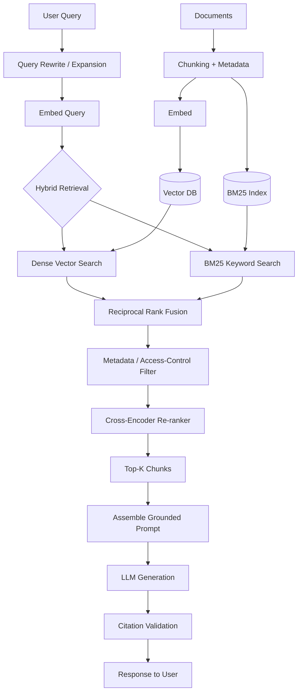

**Flow:** Query gets rewritten for retrieval, embedded, searched via both dense (semantic) and sparse (keyword) paths in parallel, fused via reciprocal rank fusion, filtered by access-control metadata, then re-ranked by a cross-encoder before the top chunks are assembled into a grounded prompt. Citation validation checks the final answer's claims are actually supported before returning to the user.

**Worked example:** A 50M-document internal knowledge base. Query "What's our refund policy for enterprise customers signed before 2023?" → hybrid search catches both semantic matches ("refund policy") and exact terms ("enterprise", "2023") → metadata filter restricts to policy-type documents the requesting user's role can see → re-ranker promotes the specific enterprise-tier clause over general consumer refund text → LLM generates an answer citing the exact clause number → citation validator confirms that clause actually contains the stated terms before returning.

---

## 2. Customer Support Agent with Escalation (Q496)

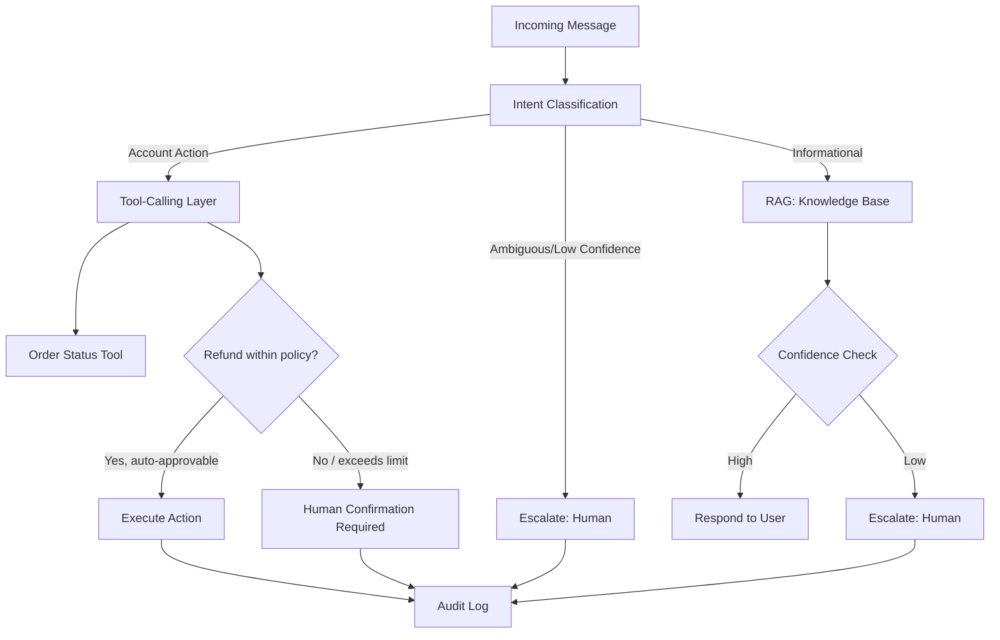

**Flow:** Every message is classified by intent first. Informational queries go through RAG with a confidence gate before responding; account actions go through scoped tools where anything outside pre-approved policy limits requires human confirmation. Every path — automated or escalated — writes to an audit log.

**Worked example:** "Where's my order #4521?" → intent = account action → order-status tool called directly, low-risk read-only action, auto-executed. "I want a $2,000 refund" → intent = account action → refund tool checks policy limit (say $200 auto-approval cap) → exceeds limit → routes to human agent with full context (order history, conversation so far) pre-loaded, rather than the user having to repeat themselves.

---

## 3. Multi-Agent Orchestration (Q455, Q456, Q472)

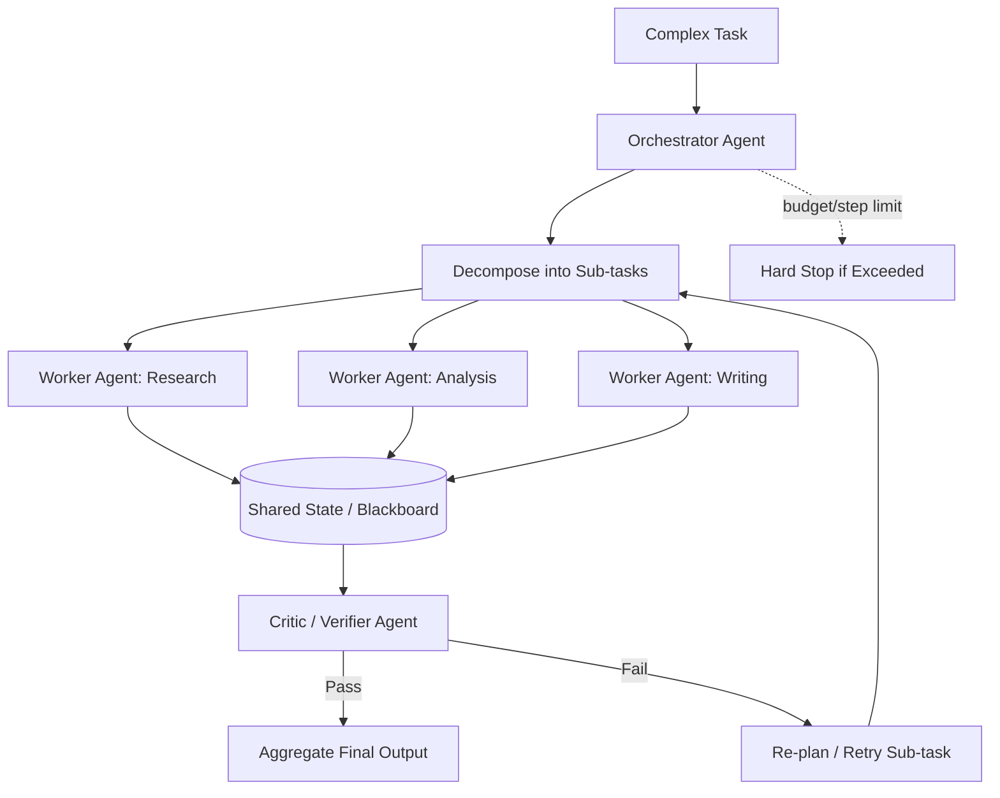

**Flow:** The orchestrator decomposes a task into sub-tasks handed to specialized worker agents, each reading/writing to shared state rather than passing messages point-to-point. A critic agent validates the combined output before final aggregation; failures trigger targeted re-planning of just the failed sub-task, not the whole pipeline. A hard step/budget limit bounds worst-case cost regardless of how re-planning goes.

**Worked example:** "Write a competitive analysis of three SaaS products." Orchestrator splits into: Research agent (gathers facts per product via web search/tool calls), Analysis agent (compares features/pricing against shared state), Writing agent (drafts the final report). Critic checks the draft against the original research for unsupported claims. If it flags an unsupported claim about Product B's pricing, only the Research agent re-runs that specific lookup — not the whole pipeline.

---

## 4. LLM Gateway / Model Routing (Q502, Q503, Q517, Q519)

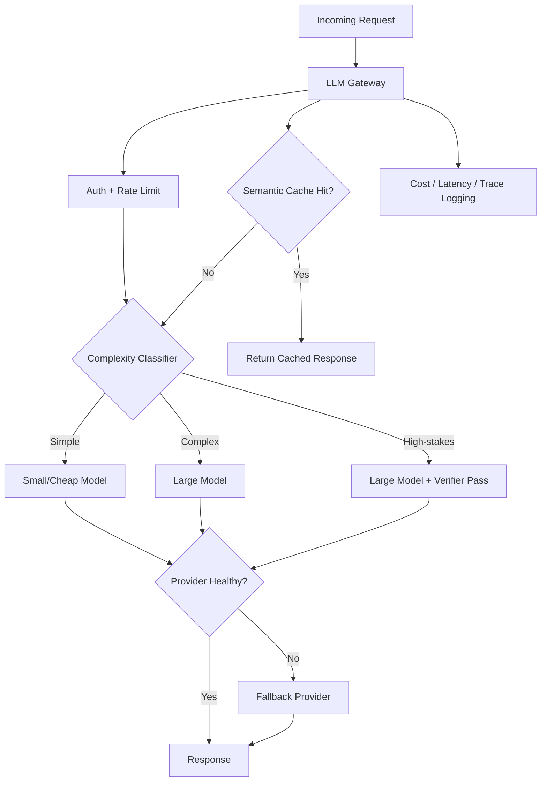

**Flow:** All requests pass through a single gateway handling auth, rate limiting, and semantic caching before any model call. A complexity classifier routes simple queries to a cheap model and complex/high-stakes ones to a larger model (with an added verifier pass for the latter). Every path checks provider health and fails over automatically; every request is logged centrally for cost/latency observability regardless of which model served it.

**Worked example:** 50 internal teams share one gateway. Team A's "summarize this ticket" requests get classified as simple → routed to a small model at $0.10/1M tokens. Team B's "draft this legal clause" requests get classified as high-stakes → routed to a large model plus a verifier pass checking the output against a compliance rubric before returning. If the primary large-model provider is down, the gateway automatically fails over to a secondary provider — neither team's integration code changes.

---

## 5. Feature Store: Online + Offline Paths (Q559, Q615, Q701)

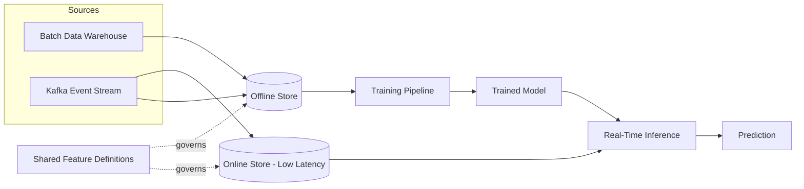

**Flow:** Both the online (low-latency, point-lookup) and offline (batch, historical-scan) stores are populated from the same shared feature definitions, so a feature computed for training matches exactly what's computed at serving time — eliminating training/serving skew by construction rather than by discipline alone.

**Worked example:** A "user's 7-day average order value" feature is defined once. The offline store computes it in nightly batch for generating training data (with point-in-time correctness — only orders before each historical training-example date). The online store computes the same definition incrementally from the Kafka order-event stream, so a fraud model scoring a live transaction sees a feature computed identically to what it was trained on.

---

## 6. Real-Time Fraud Detection (Q557, Q575)

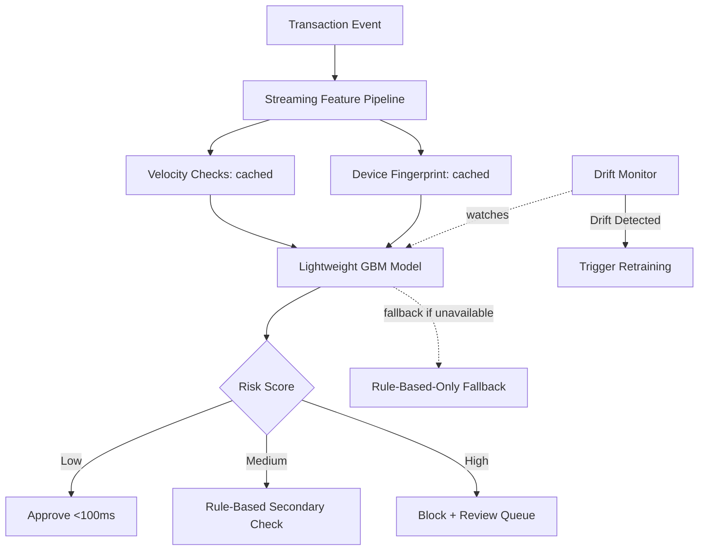

**Flow:** Precomputed/cached features (velocity, device fingerprint) feed a lightweight model chosen specifically to fit the sub-100ms latency budget. Scores route to approve/secondary-check/block tiers. A rule-based fallback exists for if the model service itself is unavailable — fraud detection can't simply fail open. Continuous drift monitoring triggers retraining given how fast fraud patterns evolve.

**Worked example:** A $9,000 transaction from a new device in a new country scores high risk (device + velocity signals both fire) → blocked and routed to a human review queue in under 100ms, while a $12 transaction from a recognized device with normal velocity approves automatically in the same latency budget.

---

## 7. Two-Stage Recommendation System (Q556, Q965)

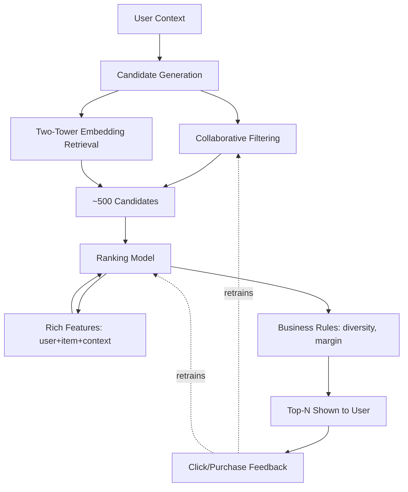

**Flow:** Candidate generation cheaply narrows millions of items to a few hundred plausible ones (via CF and/or embedding retrieval); a more expensive, feature-rich ranking model then precisely orders that shortlist; a final business-rules pass adjusts for diversity/margin before display. Feedback closes the loop back into both stages.

**Worked example:** An e-commerce homepage. Candidate generation narrows 2M products to 500 based on the user's embedding similarity to past purchases. The ranking model scores those 500 using richer features (recency, price sensitivity, current session behavior) unavailable to the cheap candidate-generation stage. A final diversity rule ensures the top 20 shown aren't all the same product category, even if the raw ranking model would have clustered them.

---

## 8. MLOps CI/CD Pipeline with Eval Gates (Q646, Q663, Q810)

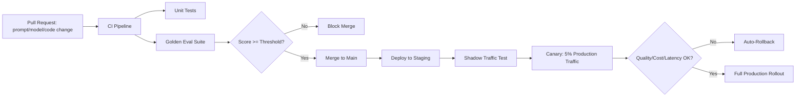

**Flow:** Every prompt, model, or code change touching the AI system runs through the same eval-gated pipeline as standard software: unit tests plus a golden eval suite must pass before merge, then staged rollout (staging → shadow → canary → full) with automated rollback if quality/cost/latency metrics degrade at any stage.

**Worked example:** An engineer tweaks a system prompt to be more concise. CI runs the golden eval suite automatically — if the tweak accidentally drops required disclaimers on 3 test cases, the merge is blocked with a specific failure report, not just a pass/fail flag. Once fixed and merged, the change goes to 5% of production traffic first; if cost drops as intended with no quality regression in monitored metrics, it ramps to 100%.

---

## 9. Multi-Provider Fallback / Disaster Recovery (Q527, Q555, Q1025)

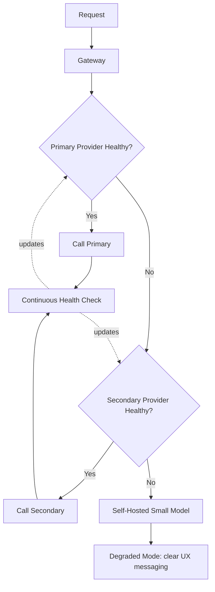

**Flow:** A layered fallback chain — primary provider, secondary provider, then a self-hosted last-resort model — ensures the product degrades gracefully rather than failing outright even if every external dependency is down simultaneously. Continuous health checks (not just reactive failure detection) keep routing decisions current.

**Worked example:** Primary provider has a regional outage. Health checks detect elevated error rates within seconds and route new requests to the secondary provider automatically — users experience slightly different response style but no visible outage. If both external providers were somehow down, the self-hosted fallback model keeps core functionality alive with a UI banner: "Running in reduced-capacity mode."

---

## 10. Cost-Optimized Serving: Caching + Batching + Quantization (Q502, Q610, Q622)

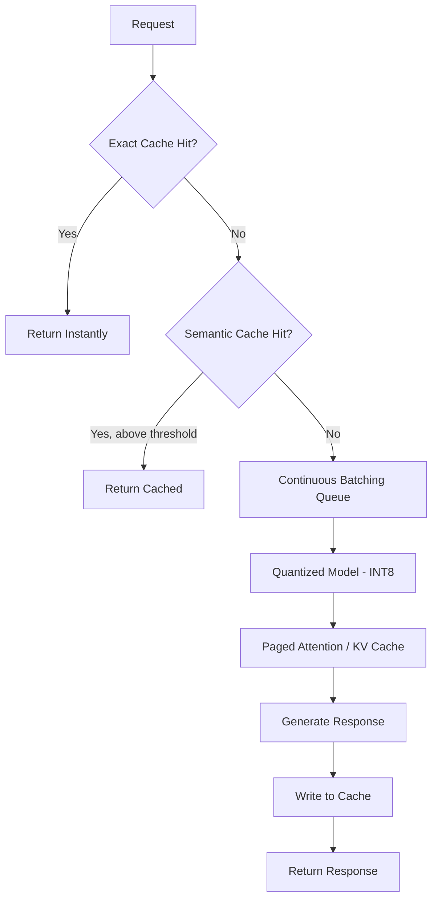

**Flow:** Cheapest option checked first (exact cache), then semantic cache (catches paraphrased repeats), only falling through to actual inference — which itself uses continuous batching, a quantized model, and paged-attention KV cache management to maximize throughput per GPU-dollar.

**Worked example:** An FAQ-heavy support bot gets "how do I reset my password" 10,000 times a day phrased 50 different ways. Exact-match cache catches identical repeats; semantic cache (embedding similarity above 0.92) catches "I forgot my password, help" as effectively the same query — only genuinely novel queries reach the model, cutting inference volume by ~70% in this example.

---

## 11. Evaluation Pipeline: Offline + Judge + Online (Q831, Q865)

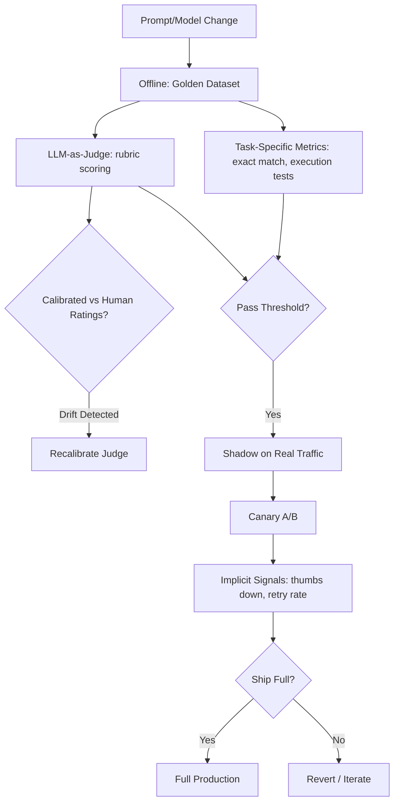

**Flow:** Offline task-specific metrics (fast, cheap, unambiguous where possible) combine with LLM-as-judge scoring (periodically recalibrated against human ratings to catch judge drift) as a pre-deployment gate. Only after passing does a change proceed to shadow testing on real traffic, then canary A/B with implicit online signals as the final real-world check before full rollout.

**Worked example:** A new prompt variant scores well on the golden dataset and passes judge calibration. In shadow mode it looks fine. In canary (5% traffic), thumbs-down rate ticks up 2x versus control even though offline scores were equal — revealing the offline eval set didn't cover a real usage pattern. The team reverts, adds the missed pattern to the golden dataset, and re-runs the full pipeline before trying again.

---

## 12. Agentic RAG with Self-Correction (Q397, Q402)

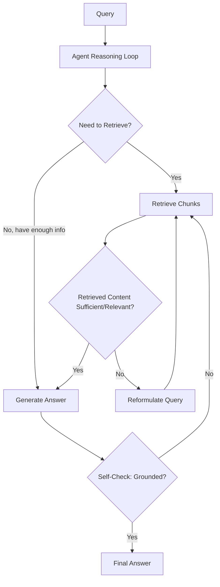

**Flow:** Unlike single-shot RAG, the agent decides for itself whether retrieved content is sufficient, reformulating and re-retrieving if not, and self-checks whether its draft answer is actually grounded in what was retrieved before finalizing — trading latency/cost for meaningfully higher reliability on hard multi-hop questions.

**Worked example:** "Which of our three EU offices has the highest attrition, and what's the top cited reason?" First retrieval finds attrition rate documents but not exit-interview reason data. The agent's assessment step recognizes the gap, reformulates a second query specifically for "exit interview reasons," retrieves that separately, and only then generates a combined answer — rather than a single-shot system generating a plausible-but-incomplete answer from the first retrieval alone.

---

## 13. Multi-Region, Data-Residency-Compliant Architecture (Q529, Q630, Q791)

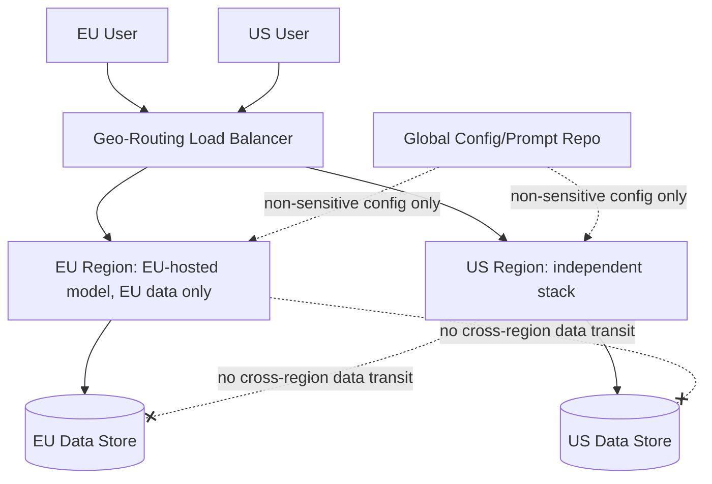

**Flow:** Users are geo-routed to a fully independent regional stack — model, data store, and logging all contained within that region — with an explicit architectural rule that no user data crosses regions. Only non-sensitive configuration (prompt templates, feature flags) syncs globally.

**Worked example:** An EU customer's document gets processed entirely by EU-hosted model endpoints and stored only in the EU data store, satisfying GDPR data-residency requirements. Even the gateway/logging infrastructure is regionally scoped — a common failure mode this design explicitly avoids is a "global" logging pipeline that inadvertently pipes EU request content through a US-based observability tool.

---

*These 13 diagrams cover the core recurring architecture patterns across Sections 13, 14, and 27. The same patterns (gateway/routing, caching layers, fallback chains, eval-gated CI/CD, two-stage retrieval-then-rank, and human-in-the-loop escalation) recombine to answer most of the remaining open-ended system-design questions in the bank.*
