

[← Back to Home](index.html) · [Question Bank →](questions.html) · [Answers →](answers.html) · [Diagrams →](diagrams.html) · [Patterns →](patterns.html) · [Sources →](sources.html) · [Simulator →](simulator.html) · [Cheat Sheet →](cheatsheet.html) · [Glossary →](glossary.html) · [Company Prep →](company-prep.html)

# AI Prep Buddy — Architecture Diagrams, Flows & Worked Examples

Diagrams for the highest-value system-design questions in the bank (Sections 13, 14, 27). GitHub renders Mermaid natively — view this file directly on github.com to see the diagrams.

---

## 1. RAG System (Q376, Q499, Q552) — Document Q&A at Scale

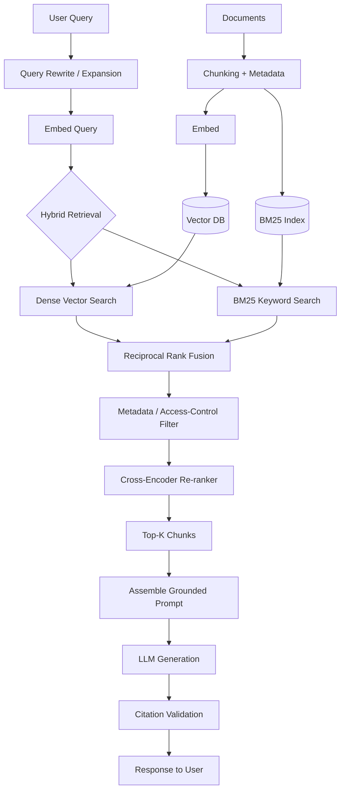
```mermaid
flowchart TD
    U[User Query] --> QR[Query Rewrite / Expansion]
    QR --> EMB[Embed Query]
    EMB --> HYB{Hybrid Retrieval}
    HYB --> DENSE[Dense Vector Search]
    HYB --> SPARSE[BM25 Keyword Search]
    DENSE --> FUSE[Reciprocal Rank Fusion]
    SPARSE --> FUSE
    FUSE --> META[Metadata / Access-Control Filter]
    META --> RERANK[Cross-Encoder Re-ranker]
    RERANK --> TOPK[Top-K Chunks]
    TOPK --> PROMPT[Assemble Grounded Prompt]
    PROMPT --> LLM[LLM Generation]
    LLM --> CITE[Citation Validation]
    CITE --> RESP[Response to User]

    DOC[Documents] --> CHUNK[Chunking + Metadata]
    CHUNK --> EMBIDX[Embed]
    EMBIDX --> VDB[(Vector DB)]
    CHUNK --> BM25IDX[(BM25 Index)]
    VDB --> DENSE
    BM25IDX --> SPARSE
```

**Flow:** Query gets rewritten for retrieval, embedded, searched via both dense (semantic) and sparse (keyword) paths in parallel, fused via reciprocal rank fusion, filtered by access-control metadata, then re-ranked by a cross-encoder before the top chunks are assembled into a grounded prompt. Citation validation checks the final answer's claims are actually supported before returning to the user.

**Worked example:** A 50M-document internal knowledge base. Query "What's our refund policy for enterprise customers signed before 2023?" → hybrid search catches both semantic matches ("refund policy") and exact terms ("enterprise", "2023") → metadata filter restricts to policy-type documents the requesting user's role can see → re-ranker promotes the specific enterprise-tier clause over general consumer refund text → LLM generates an answer citing the exact clause number → citation validator confirms that clause actually contains the stated terms before returning.

**Real-world industries using this pattern:**
- **Legal tech** — case law / precedent research assistants grounded in a firm's document repository
- **Healthcare** — clinical guideline lookup for care teams, grounded in current protocols rather than the model's general training knowledge
- **Financial services** — compliance/policy Q&A over internal regulatory documentation
- **Enterprise IT** — internal wiki, runbook, and ticket-history search for support/engineering teams

---

## 2. Customer Support Agent with Escalation (Q496)

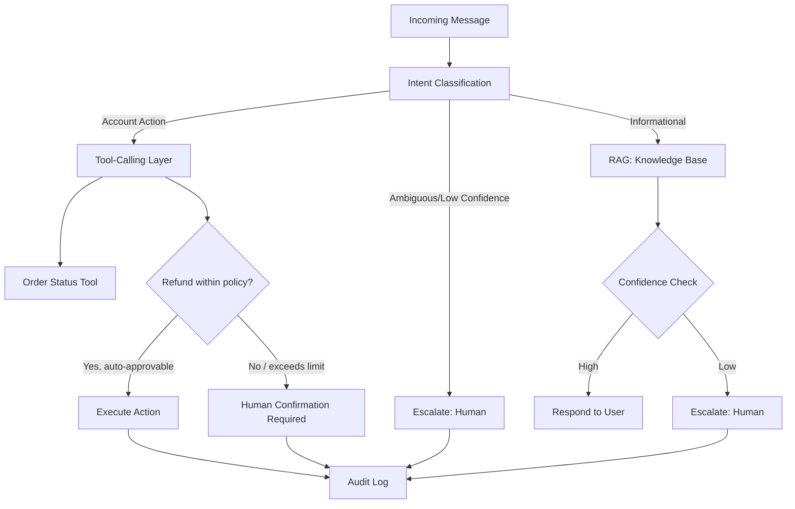
```mermaid
flowchart TD
    MSG[Incoming Message] --> INTENT[Intent Classification]
    INTENT -->|Informational| RAG[RAG: Knowledge Base]
    INTENT -->|Account Action| TOOLS[Tool-Calling Layer]
    INTENT -->|Ambiguous/Low Confidence| HUMAN1[Escalate: Human]

    TOOLS --> ORDERSTATUS[Order Status Tool]
    TOOLS --> REFUND{Refund within policy?}
    REFUND -->|Yes, auto-approvable| EXECUTE[Execute Action]
    REFUND -->|No / exceeds limit| CONFIRM[Human Confirmation Required]

    RAG --> CONF{Confidence Check}
    CONF -->|High| RESPOND[Respond to User]
    CONF -->|Low| HUMAN2[Escalate: Human]

    EXECUTE --> LOG[Audit Log]
    CONFIRM --> LOG
    HUMAN1 --> LOG
    HUMAN2 --> LOG
```

**Flow:** Every message is classified by intent first. Informational queries go through RAG with a confidence gate before responding; account actions go through scoped tools where anything outside pre-approved policy limits requires human confirmation. Every path — automated or escalated — writes to an audit log.

**Worked example:** "Where's my order #4521?" → intent = account action → order-status tool called directly, low-risk read-only action, auto-executed. "I want a $2,000 refund" → intent = account action → refund tool checks policy limit (say $200 auto-approval cap) → exceeds limit → routes to human agent with full context (order history, conversation so far) pre-loaded, rather than the user having to repeat themselves.

**Real-world industries using this pattern:**
- **Telecom** — billing and plan-change support at high volume with tiered human escalation
- **E-commerce** — order status, returns, and refund handling integrated with order-management systems
- **B2B SaaS** — tier-1 support deflection with escalation to customer success for account-specific issues
- **Banking** — balance inquiries and card-freeze requests, with mandatory human confirmation for anything touching money movement

---

## 3. Multi-Agent Orchestration (Q455, Q456, Q472)

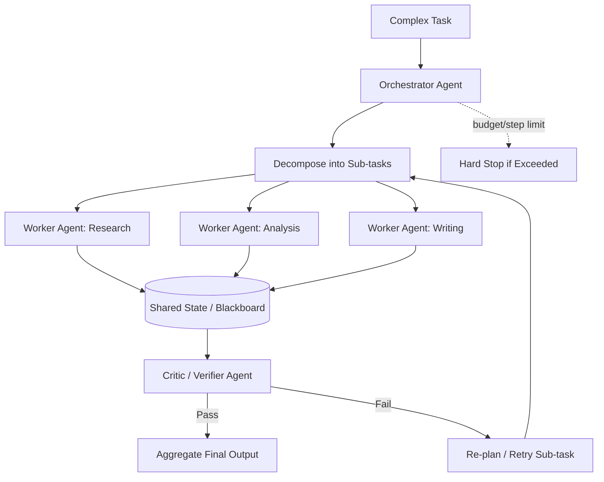
```mermaid
flowchart TD
    TASK[Complex Task] --> ORCH[Orchestrator Agent]
    ORCH --> PLAN[Decompose into Sub-tasks]
    PLAN --> A1[Worker Agent: Research]
    PLAN --> A2[Worker Agent: Analysis]
    PLAN --> A3[Worker Agent: Writing]

    A1 --> STATE[(Shared State / Blackboard)]
    A2 --> STATE
    A3 --> STATE

    STATE --> CRITIC[Critic / Verifier Agent]
    CRITIC -->|Pass| AGG[Aggregate Final Output]
    CRITIC -->|Fail| REPLAN[Re-plan / Retry Sub-task]
    REPLAN --> PLAN

    ORCH -.budget/step limit.-> KILL[Hard Stop if Exceeded]
```

**Flow:** The orchestrator decomposes a task into sub-tasks handed to specialized worker agents, each reading/writing to shared state rather than passing messages point-to-point. A critic agent validates the combined output before final aggregation; failures trigger targeted re-planning of just the failed sub-task, not the whole pipeline. A hard step/budget limit bounds worst-case cost regardless of how re-planning goes.

**Worked example:** "Write a competitive analysis of three SaaS products." Orchestrator splits into: Research agent (gathers facts per product via web search/tool calls), Analysis agent (compares features/pricing against shared state), Writing agent (drafts the final report). Critic checks the draft against the original research for unsupported claims. If it flags an unsupported claim about Product B's pricing, only the Research agent re-runs that specific lookup — not the whole pipeline.

**Real-world industries using this pattern:**
- **Management consulting** — automated first-pass market/competitor research assembled from multiple specialized research agents
- **Software engineering** — autonomous coding agents that plan, implement, and self-review changes across a codebase
- **Marketing operations** — campaign content pipelines where research, copywriting, and design-brief agents hand off sequentially
- **Equity research** — automated financial-report synthesis combining data-gathering, analysis, and writing agents

---

## 4. LLM Gateway / Model Routing (Q502, Q503, Q517, Q519)

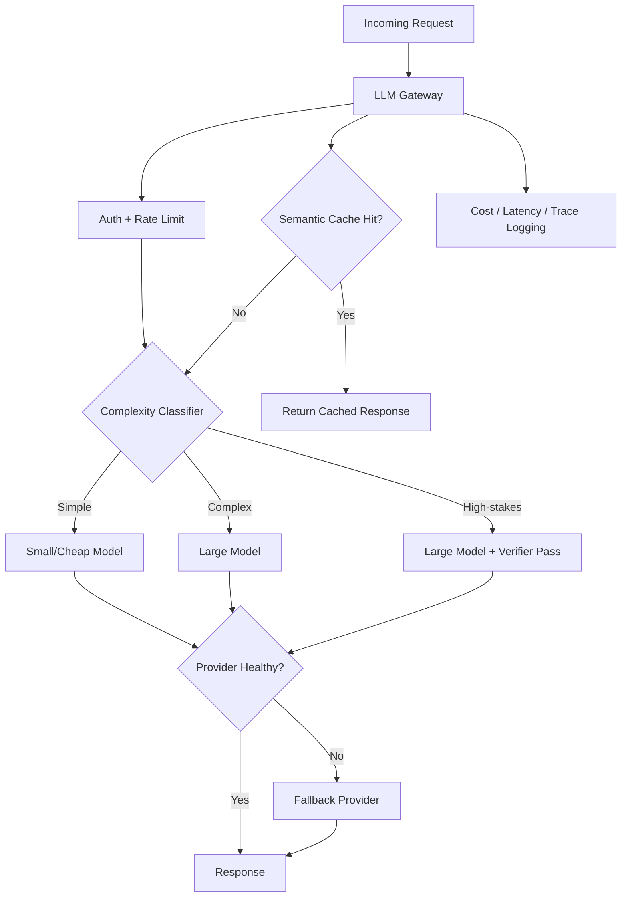
```mermaid
flowchart TD
    REQ[Incoming Request] --> GW[LLM Gateway]
    GW --> AUTH[Auth + Rate Limit]
    AUTH --> CLASSIFY{Complexity Classifier}
    CLASSIFY -->|Simple| SMALL[Small/Cheap Model]
    CLASSIFY -->|Complex| LARGE[Large Model]
    CLASSIFY -->|High-stakes| VERIFY[Large Model + Verifier Pass]

    GW --> CACHE{Semantic Cache Hit?}
    CACHE -->|Yes| RETURN1[Return Cached Response]
    CACHE -->|No| CLASSIFY

    SMALL --> HEALTH{Provider Healthy?}
    LARGE --> HEALTH
    VERIFY --> HEALTH
    HEALTH -->|No| FALLBACK[Fallback Provider]
    HEALTH -->|Yes| RESPOND[Response]
    FALLBACK --> RESPOND

    GW --> LOG[Cost / Latency / Trace Logging]
```

**Flow:** All requests pass through a single gateway handling auth, rate limiting, and semantic caching before any model call. A complexity classifier routes simple queries to a cheap model and complex/high-stakes ones to a larger model (with an added verifier pass for the latter). Every path checks provider health and fails over automatically; every request is logged centrally for cost/latency observability regardless of which model served it.

**Worked example:** 50 internal teams share one gateway. Team A's "summarize this ticket" requests get classified as simple → routed to a small model at $0.10/1M tokens. Team B's "draft this legal clause" requests get classified as high-stakes → routed to a large model plus a verifier pass checking the output against a compliance rubric before returning. If the primary large-model provider is down, the gateway automatically fails over to a secondary provider — neither team's integration code changes.

**Real-world industries using this pattern:**
- **Large enterprises with many internal AI features** — a shared platform team serving 20+ product teams through one gateway
- **Fintech** — cost-sensitive at scale, where routing simple queries to cheap models materially affects unit economics
- **Big tech internal tooling** — standardizing model access company-wide without every team re-building auth/logging/fallback
- **Consulting/agencies** — serving multiple end-clients through one controlled, auditable AI access layer

---

## 5. Feature Store: Online + Offline Paths (Q559, Q615, Q701)

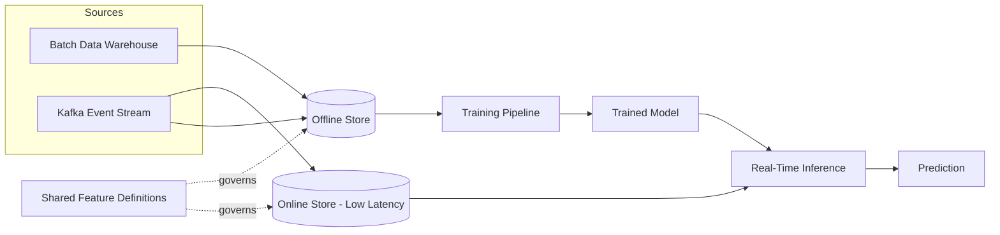
```mermaid
flowchart LR
    subgraph Sources
        BATCH[Batch Data Warehouse]
        STREAM[Kafka Event Stream]
    end

    BATCH --> OFFLINE[(Offline Store)]
    STREAM --> ONLINE[(Online Store - Low Latency)]
    STREAM --> OFFLINE

    OFFLINE --> TRAIN[Training Pipeline]
    TRAIN --> MODEL[Trained Model]

    ONLINE --> SERVE[Real-Time Inference]
    MODEL --> SERVE
    SERVE --> PRED[Prediction]

    DEF[Shared Feature Definitions] -.governs.-> OFFLINE
    DEF -.governs.-> ONLINE
```

**Flow:** Both the online (low-latency, point-lookup) and offline (batch, historical-scan) stores are populated from the same shared feature definitions, so a feature computed for training matches exactly what's computed at serving time — eliminating training/serving skew by construction rather than by discipline alone.

**Worked example:** A "user's 7-day average order value" feature is defined once. The offline store computes it in nightly batch for generating training data (with point-in-time correctness — only orders before each historical training-example date). The online store computes the same definition incrementally from the Kafka order-event stream, so a fraud model scoring a live transaction sees a feature computed identically to what it was trained on.

**Real-world industries using this pattern:**
- **E-commerce** — real-time personalization features (recently-viewed, propensity-to-buy) at checkout
- **Ride-sharing** — ETA and dynamic-pricing features requiring both historical training data and real-time serving
- **Banking** — real-time fraud-scoring features consistent between model training and live transaction scoring
- **Streaming media** — recommendation features blending long-term taste profiles with in-session behavior

---

## 6. Real-Time Fraud Detection (Q557, Q575)

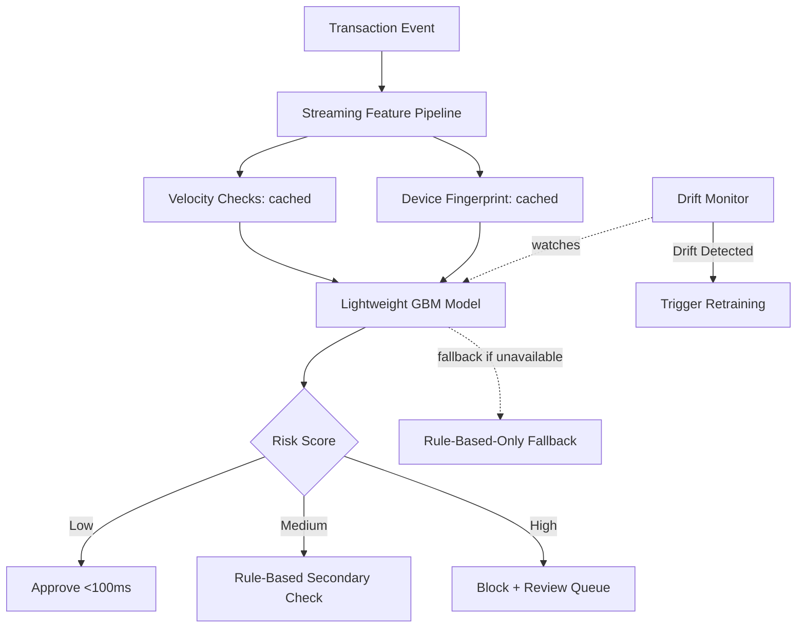
```mermaid
flowchart TD
    TXN[Transaction Event] --> STREAM[Streaming Feature Pipeline]
    STREAM --> VELOCITY[Velocity Checks: cached]
    STREAM --> DEVICE[Device Fingerprint: cached]
    VELOCITY --> MODEL[Lightweight GBM Model]
    DEVICE --> MODEL
    MODEL --> SCORE{Risk Score}
    SCORE -->|Low| APPROVE[Approve <100ms]
    SCORE -->|Medium| RULES[Rule-Based Secondary Check]
    SCORE -->|High| BLOCK[Block + Review Queue]

    MODEL -.fallback if unavailable.-> RULEFALLBACK[Rule-Based-Only Fallback]

    MONITOR[Drift Monitor] -.watches.-> MODEL
    MONITOR -->|Drift Detected| RETRAIN[Trigger Retraining]
```

**Flow:** Precomputed/cached features (velocity, device fingerprint) feed a lightweight model chosen specifically to fit the sub-100ms latency budget. Scores route to approve/secondary-check/block tiers. A rule-based fallback exists for if the model service itself is unavailable — fraud detection can't simply fail open. Continuous drift monitoring triggers retraining given how fast fraud patterns evolve.

**Worked example:** A $9,000 transaction from a new device in a new country scores high risk (device + velocity signals both fire) → blocked and routed to a human review queue in under 100ms, while a $12 transaction from a recognized device with normal velocity approves automatically in the same latency budget.

**Real-world industries using this pattern:**
- **Payments/card networks** — transaction-level fraud scoring industry-wide (Visa/Mastercard-style networks)
- **Retail banking** — account-takeover and unusual-activity detection
- **Insurance** — claims-fraud detection at intake
- **E-commerce** — checkout fraud and stolen-card detection

---

## 7. Two-Stage Recommendation System (Q556, Q965)

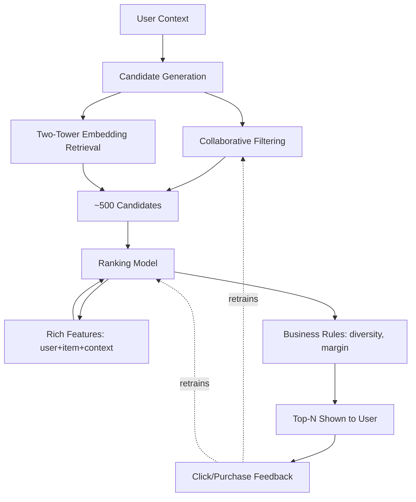
```mermaid
flowchart TD
    USER[User Context] --> CANDGEN[Candidate Generation]
    CANDGEN --> CF[Collaborative Filtering]
    CANDGEN --> TWOTOWER[Two-Tower Embedding Retrieval]
    CF --> CANDIDATES[~500 Candidates]
    TWOTOWER --> CANDIDATES

    CANDIDATES --> RANK[Ranking Model]
    RANK --> FEATURES[Rich Features: user+item+context]
    FEATURES --> RANK
    RANK --> RERANK[Business Rules: diversity, margin]
    RERANK --> TOP[Top-N Shown to User]

    TOP --> FEEDBACK[Click/Purchase Feedback]
    FEEDBACK -.retrains.-> CF
    FEEDBACK -.retrains.-> RANK
```

**Flow:** Candidate generation cheaply narrows millions of items to a few hundred plausible ones (via CF and/or embedding retrieval); a more expensive, feature-rich ranking model then precisely orders that shortlist; a final business-rules pass adjusts for diversity/margin before display. Feedback closes the loop back into both stages.

**Worked example:** An e-commerce homepage. Candidate generation narrows 2M products to 500 based on the user's embedding similarity to past purchases. The ranking model scores those 500 using richer features (recency, price sensitivity, current session behavior) unavailable to the cheap candidate-generation stage. A final diversity rule ensures the top 20 shown aren't all the same product category, even if the raw ranking model would have clustered them.

**Real-world industries using this pattern:**
- **E-commerce** — product recommendations on category and checkout pages
- **Streaming (video/music)** — "recommended for you" and autoplay queues
- **Social media** — feed ranking balancing engagement and diversity
- **Job platforms** — candidate-to-job and job-to-candidate matching at scale

---

## 8. MLOps CI/CD Pipeline with Eval Gates (Q646, Q663, Q810)

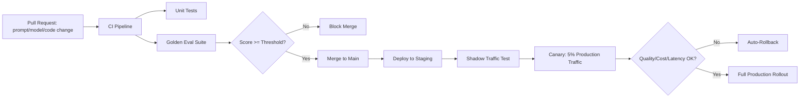
```mermaid
flowchart LR
    PR[Pull Request: prompt/model/code change] --> CI[CI Pipeline]
    CI --> UNIT[Unit Tests]
    CI --> GOLDEN[Golden Eval Suite]
    GOLDEN --> SCORE{Score >= Threshold?}
    SCORE -->|No| BLOCK[Block Merge]
    SCORE -->|Yes| MERGE[Merge to Main]
    MERGE --> STAGE[Deploy to Staging]
    STAGE --> SHADOW[Shadow Traffic Test]
    SHADOW --> CANARY[Canary: 5% Production Traffic]
    CANARY --> MONITOR{Quality/Cost/Latency OK?}
    MONITOR -->|No| ROLLBACK[Auto-Rollback]
    MONITOR -->|Yes| FULL[Full Production Rollout]
```

**Flow:** Every prompt, model, or code change touching the AI system runs through the same eval-gated pipeline as standard software: unit tests plus a golden eval suite must pass before merge, then staged rollout (staging → shadow → canary → full) with automated rollback if quality/cost/latency metrics degrade at any stage.

**Worked example:** An engineer tweaks a system prompt to be more concise. CI runs the golden eval suite automatically — if the tweak accidentally drops required disclaimers on 3 test cases, the merge is blocked with a specific failure report, not just a pass/fail flag. Once fixed and merged, the change goes to 5% of production traffic first; if cost drops as intended with no quality regression in monitored metrics, it ramps to 100%.

**Real-world industries using this pattern:**
- **Regulated fintech** — every prompt/model change subject to compliance-auditable eval gates
- **Healthcare AI** — clinical-decision-support features requiring documented validation before any production change
- **Big tech ML platforms** — standard practice for any team shipping frequent model/prompt iterations
- **Any consumer AI product at scale** — preventing quality regressions from reaching millions of users

---

## 9. Multi-Provider Fallback / Disaster Recovery (Q527, Q555, Q1025)

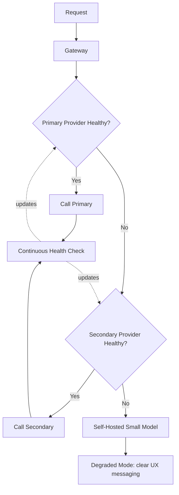
```mermaid
flowchart TD
    REQ[Request] --> GW[Gateway]
    GW --> P1{Primary Provider Healthy?}
    P1 -->|Yes| CALL1[Call Primary]
    P1 -->|No| P2{Secondary Provider Healthy?}
    P2 -->|Yes| CALL2[Call Secondary]
    P2 -->|No| P3[Self-Hosted Small Model]
    P3 --> DEGRADED[Degraded Mode: clear UX messaging]

    CALL1 --> HEALTHCHECK[Continuous Health Check]
    CALL2 --> HEALTHCHECK
    HEALTHCHECK -.updates.-> P1
    HEALTHCHECK -.updates.-> P2
```

**Flow:** A layered fallback chain — primary provider, secondary provider, then a self-hosted last-resort model — ensures the product degrades gracefully rather than failing outright even if every external dependency is down simultaneously. Continuous health checks (not just reactive failure detection) keep routing decisions current.

**Worked example:** Primary provider has a regional outage. Health checks detect elevated error rates within seconds and route new requests to the secondary provider automatically — users experience slightly different response style but no visible outage. If both external providers were somehow down, the self-hosted fallback model keeps core functionality alive with a UI banner: "Running in reduced-capacity mode."

**Real-world industries using this pattern:**
- **Mission-critical SaaS** — any product where an AI feature outage is a support/trust incident
- **Telemedicine** — AI-assisted triage tools that must degrade gracefully, never fail outright
- **Financial trading tools** — research/analysis copilots needing near-100% availability during market hours
- **Government/public-sector digital services** — citizen-facing AI tools under strict uptime expectations

---

## 10. Cost-Optimized Serving: Caching + Batching + Quantization (Q502, Q610, Q622)

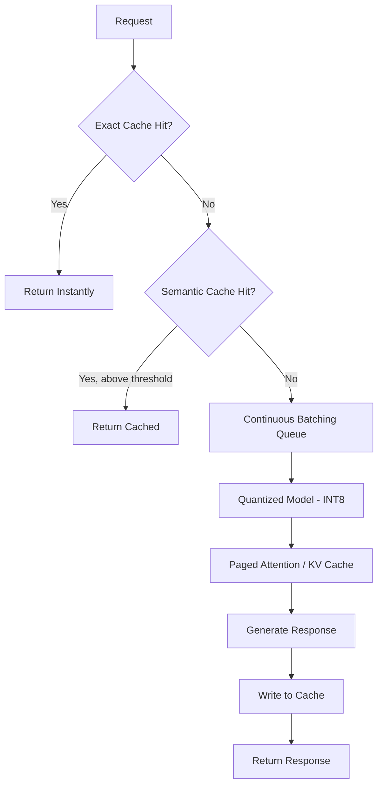
```mermaid
flowchart TD
    REQ[Request] --> EXACTCACHE{Exact Cache Hit?}
    EXACTCACHE -->|Yes| RETURN1[Return Instantly]
    EXACTCACHE -->|No| SEMCACHE{Semantic Cache Hit?}
    SEMCACHE -->|Yes, above threshold| RETURN2[Return Cached]
    SEMCACHE -->|No| BATCH[Continuous Batching Queue]
    BATCH --> QUANT[Quantized Model - INT8]
    QUANT --> KVCACHE[Paged Attention / KV Cache]
    KVCACHE --> GEN[Generate Response]
    GEN --> STORECACHE[Write to Cache]
    STORECACHE --> RETURN3[Return Response]
```

**Flow:** Cheapest option checked first (exact cache), then semantic cache (catches paraphrased repeats), only falling through to actual inference — which itself uses continuous batching, a quantized model, and paged-attention KV cache management to maximize throughput per GPU-dollar.

**Worked example:** An FAQ-heavy support bot gets "how do I reset my password" 10,000 times a day phrased 50 different ways. Exact-match cache catches identical repeats; semantic cache (embedding similarity above 0.92) catches "I forgot my password, help" as effectively the same query — only genuinely novel queries reach the model, cutting inference volume by ~70% in this example.

**Real-world industries using this pattern:**
- **High-volume consumer apps** — chatbots/assistants serving millions of similar queries
- **Customer support platforms** — FAQ-heavy traffic ideal for semantic caching
- **EdTech** — tutoring apps answering common conceptual questions repeatedly across many students
- **Developer tools** — coding assistants where common boilerplate requests repeat constantly across users

---

## 11. Evaluation Pipeline: Offline + Judge + Online (Q831, Q865)

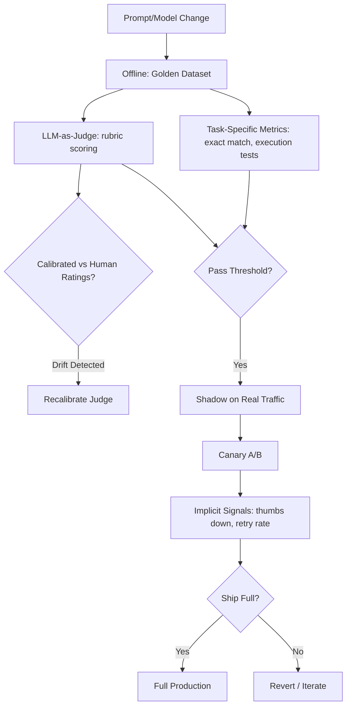
```mermaid
flowchart TD
    CHANGE[Prompt/Model Change] --> OFFLINE[Offline: Golden Dataset]
    OFFLINE --> AUTOMETRIC[Task-Specific Metrics: exact match, execution tests]
    OFFLINE --> JUDGE[LLM-as-Judge: rubric scoring]
    JUDGE --> CALIBRATE{Calibrated vs Human Ratings?}
    CALIBRATE -->|Drift Detected| RECALIBRATE[Recalibrate Judge]

    AUTOMETRIC --> GATE{Pass Threshold?}
    JUDGE --> GATE
    GATE -->|Yes| SHADOW[Shadow on Real Traffic]
    SHADOW --> CANARY[Canary A/B]
    CANARY --> IMPLICIT[Implicit Signals: thumbs down, retry rate]
    IMPLICIT --> DECISION{Ship Full?}
    DECISION -->|Yes| PROD[Full Production]
    DECISION -->|No| REVERT[Revert / Iterate]
```

**Flow:** Offline task-specific metrics (fast, cheap, unambiguous where possible) combine with LLM-as-judge scoring (periodically recalibrated against human ratings to catch judge drift) as a pre-deployment gate. Only after passing does a change proceed to shadow testing on real traffic, then canary A/B with implicit online signals as the final real-world check before full rollout.

**Worked example:** A new prompt variant scores well on the golden dataset and passes judge calibration. In shadow mode it looks fine. In canary (5% traffic), thumbs-down rate ticks up 2x versus control even though offline scores were equal — revealing the offline eval set didn't cover a real usage pattern. The team reverts, adds the missed pattern to the golden dataset, and re-runs the full pipeline before trying again.

**Real-world industries using this pattern:**
- **Any enterprise shipping LLM features regularly** — the baseline practice for responsible iteration speed
- **Legal tech** — where an ungated regression could produce a materially wrong legal summary
- **Healthcare AI** — clinical-facing tools requiring documented, repeatable validation
- **Regulated fintech** — audit trails showing every production change was validated before shipping

---

## 12. Agentic RAG with Self-Correction (Q397, Q402)

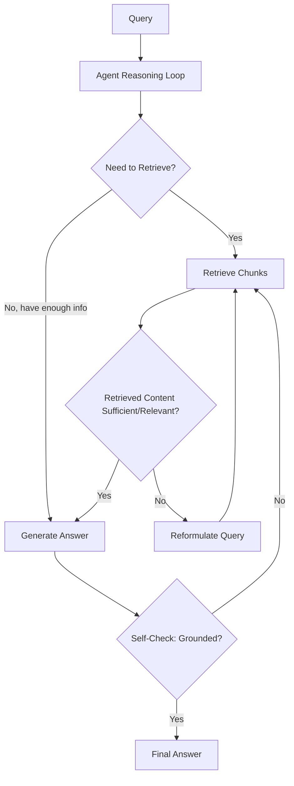
```mermaid
flowchart TD
    Q[Query] --> AGENT[Agent Reasoning Loop]
    AGENT --> DECIDE{Need to Retrieve?}
    DECIDE -->|Yes| RETRIEVE[Retrieve Chunks]
    DECIDE -->|No, have enough info| GENERATE[Generate Answer]
    RETRIEVE --> ASSESS{Retrieved Content Sufficient/Relevant?}
    ASSESS -->|No| REFORMULATE[Reformulate Query]
    REFORMULATE --> RETRIEVE
    ASSESS -->|Yes| GENERATE
    GENERATE --> SELFCHECK{Self-Check: Grounded?}
    SELFCHECK -->|No| RETRIEVE
    SELFCHECK -->|Yes| RESPOND[Final Answer]
```

**Flow:** Unlike single-shot RAG, the agent decides for itself whether retrieved content is sufficient, reformulating and re-retrieving if not, and self-checks whether its draft answer is actually grounded in what was retrieved before finalizing — trading latency/cost for meaningfully higher reliability on hard multi-hop questions.

**Worked example:** "Which of our three EU offices has the highest attrition, and what's the top cited reason?" First retrieval finds attrition rate documents but not exit-interview reason data. The agent's assessment step recognizes the gap, reformulates a second query specifically for "exit interview reasons," retrieves that separately, and only then generates a combined answer — rather than a single-shot system generating a plausible-but-incomplete answer from the first retrieval alone.

**Real-world industries using this pattern:**
- **Enterprise knowledge management** — answering multi-hop questions spanning several internal systems
- **Legal research** — connecting facts across multiple case documents or statutes
- **Pharma R&D** — literature review requiring synthesis across many papers, not single-document lookup
- **Management consulting** — client research requiring iterative digging rather than one retrieval pass

---

## 13. Multi-Region, Data-Residency-Compliant Architecture (Q529, Q630, Q791)

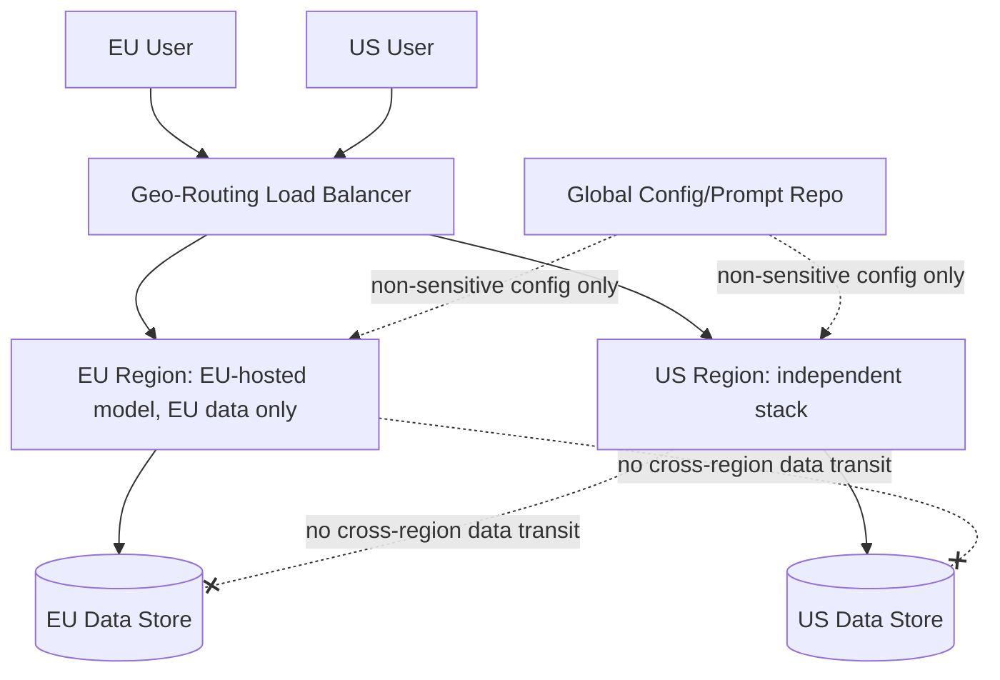
```mermaid
flowchart TD
    USER_EU[EU User] --> LB[Geo-Routing Load Balancer]
    USER_US[US User] --> LB
    LB --> EUREGION[EU Region: EU-hosted model, EU data only]
    LB --> USREGION[US Region: independent stack]

    EUREGION --> EUDATA[(EU Data Store)]
    USREGION --> USDATA[(US Data Store)]

    EUREGION -.no cross-region data transit.-x USDATA
    USREGION -.no cross-region data transit.-x EUDATA

    GLOBAL[Global Config/Prompt Repo] -.non-sensitive config only.-> EUREGION
    GLOBAL -.non-sensitive config only.-> USREGION
```

**Flow:** Users are geo-routed to a fully independent regional stack — model, data store, and logging all contained within that region — with an explicit architectural rule that no user data crosses regions. Only non-sensitive configuration (prompt templates, feature flags) syncs globally.

**Worked example:** An EU customer's document gets processed entirely by EU-hosted model endpoints and stored only in the EU data store, satisfying GDPR data-residency requirements. Even the gateway/logging infrastructure is regionally scoped — a common failure mode this design explicitly avoids is a "global" logging pipeline that inadvertently pipes EU request content through a US-based observability tool.

**Real-world industries using this pattern:**
- **Global SaaS companies** — serving both EU and US customers under different data-residency regimes
- **Healthcare** — HIPAA (US) and GDPR (EU) compliance simultaneously for a multinational health platform
- **Banking** — cross-border financial services with strict national data-sovereignty rules
- **Government contracts** — sovereign-cloud requirements for public-sector deployments

---

*These 13 diagrams cover the core recurring architecture patterns across Sections 13, 14, and 27. The same patterns (gateway/routing, caching layers, fallback chains, eval-gated CI/CD, two-stage retrieval-then-rank, and human-in-the-loop escalation) recombine to answer most of the remaining open-ended system-design questions in the bank.*

---

## 14. Code Review Agent Integrated with CI (Q497)

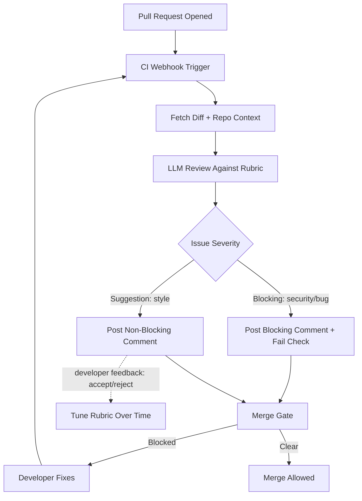
```mermaid
flowchart TD
    PR[Pull Request Opened] --> WEBHOOK[CI Webhook Trigger]
    WEBHOOK --> FETCH[Fetch Diff + Repo Context]
    FETCH --> LLM[LLM Review Against Rubric]
    LLM --> CATEGORIZE{Issue Severity}
    CATEGORIZE -->|Blocking: security/bug| BLOCK[Post Blocking Comment + Fail Check]
    CATEGORIZE -->|Suggestion: style| SUGGEST[Post Non-Blocking Comment]
    BLOCK --> MERGE_GATE[Merge Gate]
    SUGGEST --> MERGE_GATE
    MERGE_GATE -->|Blocked| DEV[Developer Fixes]
    DEV --> WEBHOOK
    MERGE_GATE -->|Clear| MERGE[Merge Allowed]
    SUGGEST -.developer feedback: accept/reject.-> TUNE[Tune Rubric Over Time]
```

**Worked example:** A PR removes a null check on a user-input field. The agent flags it as blocking (potential crash/security issue) with an inline comment explaining the specific risk; a PR that just uses inconsistent variable naming gets a non-blocking suggestion. Merge is only gated on the blocking category, keeping the bar high without slowing down every PR with nitpicks.

**Real-world industries using this pattern:**
- **Software product companies** — standardizing review quality across a large, distributed engineering org
- **DevOps/platform engineering teams** — enforcing infra-as-code and security review standards automatically
- **Open-source projects** — triaging high PR volume from external contributors with limited maintainer time
- **Fintech engineering** — enforcing compliance-sensitive coding standards (PCI-DSS, SOX) automatically

---

## 15. Voice Assistant Pipeline: ASR → LLM → TTS (Q508)

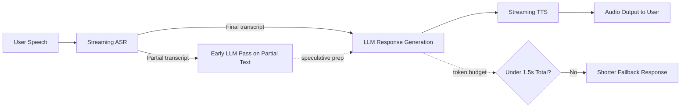
```mermaid
flowchart LR
    AUDIO[User Speech] --> ASR[Streaming ASR]
    ASR -->|Partial transcript| EARLYLLM[Early LLM Pass on Partial Text]
    ASR -->|Final transcript| LLM[LLM Response Generation]
    EARLYLLM -.speculative prep.-> LLM
    LLM --> TTS[Streaming TTS]
    TTS --> AUDIOOUT[Audio Output to User]

    LLM -.token budget.-> DEADLINE{Under 1.5s Total?}
    DEADLINE -->|No| FASTFALLBACK[Shorter Fallback Response]
```

**Worked example:** ASR streams partial transcripts as the user speaks; the system starts a speculative LLM pass on the likely-final partial text before the user even finishes talking, so by the time the final transcript arrives, generation is already partway done — TTS then starts streaming audio from the first generated sentence rather than waiting for the full response, keeping perceived latency under ~1.5s end-to-end.

**Real-world industries using this pattern:**
- **Call centers** — IVR replacement and first-line phone support
- **Automotive** — in-car voice assistants for navigation, calls, and vehicle controls
- **Smart home** — voice-controlled device management
- **Healthcare** — nurse-triage phone lines handling routine symptom-intake calls

---

## 16. Safe Natural-Language-to-SQL (Q513)

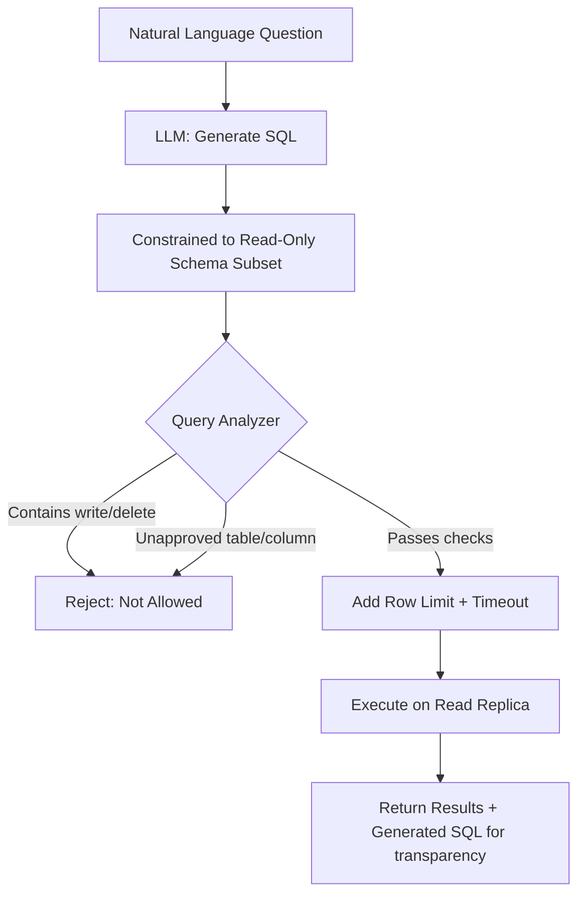
```mermaid
flowchart TD
    NLQ[Natural Language Question] --> LLM[LLM: Generate SQL]
    LLM --> SCHEMA[Constrained to Read-Only Schema Subset]
    SCHEMA --> VALIDATE{Query Analyzer}
    VALIDATE -->|Contains write/delete| REJECT[Reject: Not Allowed]
    VALIDATE -->|Unapproved table/column| REJECT
    VALIDATE -->|Passes checks| LIMIT[Add Row Limit + Timeout]
    LIMIT --> SANDBOX[Execute on Read Replica]
    SANDBOX --> RESULT[Return Results + Generated SQL for transparency]
```

**Worked example:** "Show me revenue by region last quarter" generates a `SELECT` query scoped to approved tables. If the LLM hallucinates a `DELETE` or references an unapproved `salaries` table, the query analyzer rejects it before execution — never trusting the LLM's output as inherently safe SQL, only as a draft to be validated against an explicit allowlist.

**Real-world industries using this pattern:**
- **Business intelligence teams** — letting non-SQL-fluent stakeholders query dashboards in plain language
- **Retail/e-commerce** — ad hoc sales and inventory questions from merchandising teams
- **Internal data platforms** — self-serve analytics without needing a data analyst for every question
- **SaaS analytics products** — natural-language query as a customer-facing product feature

---

## 17. Content Moderation Pipeline: Classifiers + LLM Judge (Q511)

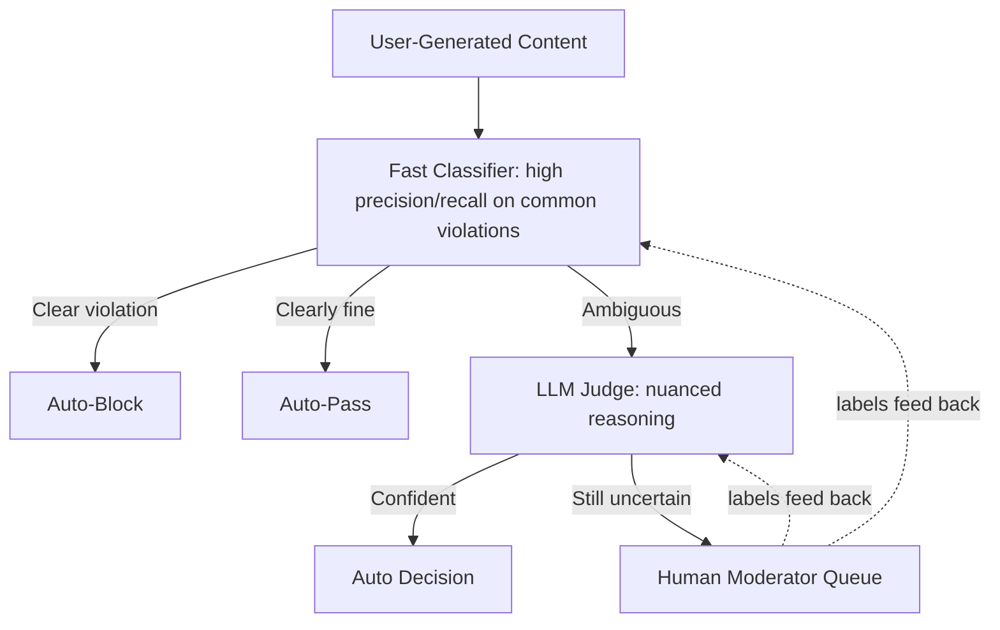
```mermaid
flowchart TD
    CONTENT[User-Generated Content] --> FAST[Fast Classifier: high precision/recall on common violations]
    FAST -->|Clear violation| AUTOBLOCK[Auto-Block]
    FAST -->|Clearly fine| AUTOPASS[Auto-Pass]
    FAST -->|Ambiguous| LLMJUDGE[LLM Judge: nuanced reasoning]
    LLMJUDGE -->|Confident| DECISION[Auto Decision]
    LLMJUDGE -->|Still uncertain| HUMAN[Human Moderator Queue]
    HUMAN -.labels feed back.-> FAST
    HUMAN -.labels feed back.-> LLMJUDGE
```

**Worked example:** Obvious spam/known-slur content is auto-blocked by the fast classifier in milliseconds at huge volume. Borderline sarcasm or context-dependent content escalates to the LLM judge, which reasons about context the fast classifier can't. Only the hardest remaining cases reach a human — and every human decision becomes future training/calibration data for the earlier tiers.

**Real-world industries using this pattern:**
- **Social media platforms** — comment and post moderation at massive scale
- **Online marketplaces** — fake/fraudulent listing detection
- **Gaming** — in-game chat moderation for harassment and toxicity
- **Dating apps** — profile and message screening for safety

---

## 18. Human-Approved Knowledge Base Editing (Q516)

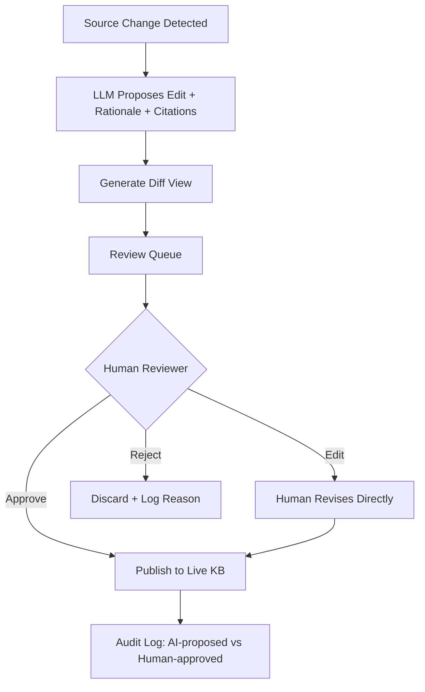
```mermaid
flowchart TD
    SOURCE[Source Change Detected] --> LLM[LLM Proposes Edit + Rationale + Citations]
    LLM --> DIFF[Generate Diff View]
    DIFF --> QUEUE[Review Queue]
    QUEUE --> HUMAN{Human Reviewer}
    HUMAN -->|Approve| PUBLISH[Publish to Live KB]
    HUMAN -->|Edit| REVISE[Human Revises Directly]
    HUMAN -->|Reject| DISCARD[Discard + Log Reason]
    REVISE --> PUBLISH
    PUBLISH --> AUDIT[Audit Log: AI-proposed vs Human-approved]
```

**Worked example:** A product spec doc changes upstream; the AI detects the relevant KB article is now stale, proposes a specific diff with the source citation, and queues it. A human reviewer either approves as-is, tweaks the wording, or rejects if the AI misread the change — nothing reaches the live KB without that explicit human step, and every publish is traceable to whether it was AI-original or human-modified.

**Real-world industries using this pattern:**
- **Enterprise knowledge management** — keeping internal documentation synced with changing source systems
- **Customer support content ops** — keeping help-center articles current as product features change
- **Legal document management** — controlled updates to policy/compliance documents
- **HR** — keeping benefits and policy documentation current with human sign-off given legal sensitivity

---

## 19. Structured Data Extraction at Scale (Q506)

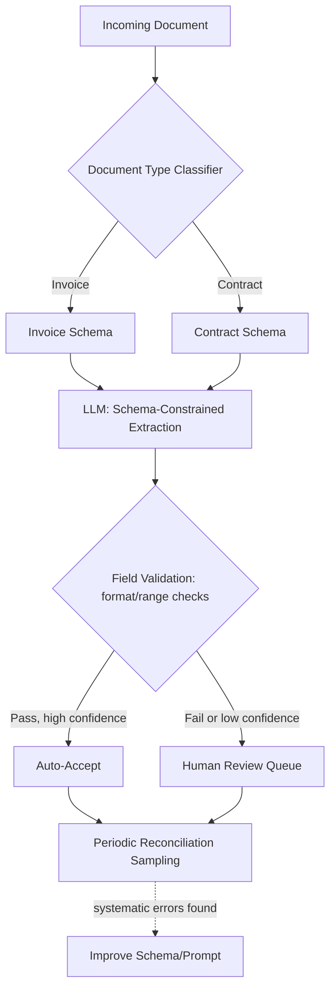
```mermaid
flowchart TD
    DOC[Incoming Document] --> TYPE{Document Type Classifier}
    TYPE -->|Invoice| SCHEMA_A[Invoice Schema]
    TYPE -->|Contract| SCHEMA_B[Contract Schema]
    SCHEMA_A --> LLM[LLM: Schema-Constrained Extraction]
    SCHEMA_B --> LLM
    LLM --> VALIDATE{Field Validation: format/range checks}
    VALIDATE -->|Pass, high confidence| AUTO[Auto-Accept]
    VALIDATE -->|Fail or low confidence| REVIEW[Human Review Queue]
    AUTO --> RECONCILE[Periodic Reconciliation Sampling]
    REVIEW --> RECONCILE
    RECONCILE -.systematic errors found.-> IMPROVE[Improve Schema/Prompt]
```

**Worked example:** Invoices auto-route to an invoice-specific schema; extracted totals get validated against expected numeric ranges and currency formats. A total that's wildly out of range (a $50 invoice extracted as $50,000) fails validation and routes to human review rather than silently propagating a likely extraction error downstream.

**Real-world industries using this pattern:**
- **Insurance** — claims-form and supporting-document data extraction
- **Accounts payable** — invoice processing and PO matching at scale
- **Legal** — contract metadata extraction (parties, dates, obligations) for contract management systems
- **Healthcare** — digitizing structured fields from scanned medical records/intake forms

---

## 20. PII Redaction Before External LLM Calls (Q534)

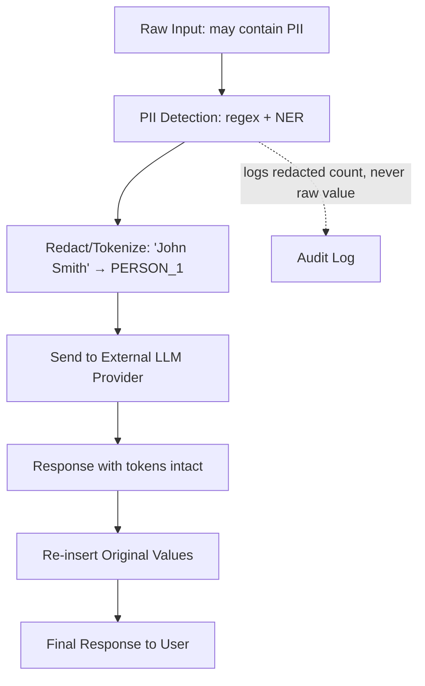
```mermaid
flowchart TD
    INPUT[Raw Input: may contain PII] --> DETECT[PII Detection: regex + NER]
    DETECT --> REDACT[Redact/Tokenize: 'John Smith' → PERSON_1]
    REDACT --> EXTERNAL[Send to External LLM Provider]
    EXTERNAL --> RESPONSE[Response with tokens intact]
    RESPONSE --> REHYDRATE[Re-insert Original Values]
    REHYDRATE --> USER[Final Response to User]

    DETECT -.logs redacted count, never raw value.-> AUDITLOG[Audit Log]
```

**Worked example:** "Draft a follow-up email to John Smith about his $45,000 loan application" gets tokenized to "Draft a follow-up email to PERSON_1 about his AMOUNT_1 loan application" before ever leaving your infrastructure. The external provider never sees the real name or amount; the response is re-hydrated with the real values only after returning, inside your trusted boundary.

**Real-world industries using this pattern:**
- **Healthcare** — HIPAA-mandated PHI protection before any external AI service call
- **Financial services** — protecting account numbers and SSNs in customer service AI tooling
- **HR tech** — protecting employee PII in AI-assisted HR workflows
- **Legal services** — protecting client-privileged information sent to any third-party AI tool

---

## 21. Credit-Risk Scoring with Explainability (Q563)

```mermaid
flowchart TD
    APP[Loan Application] --> FEATURES[Feature Engineering]
    FEATURES --> MODEL[Gradient Boosted Model]
    MODEL --> SCORE[Risk Score]
    SCORE --> DECISION{Decision Threshold}
    DECISION -->|Approve| SHAP1[SHAP Explanation: top positive factors]
    DECISION -->|Decline| SHAP2[SHAP Explanation: top adverse factors]
    SHAP2 --> NOTICE[Adverse Action Notice: regulatory requirement]
    SHAP1 --> LOG[Decision + Explanation Logged]
    NOTICE --> LOG
    LOG --> VALIDATION[Independent Model Validation Team]
```

**Worked example:** A declined application automatically generates a SHAP-based explanation identifying the top 3-4 factors driving the decline (e.g., debt-to-income ratio, credit history length) — required for a compliant adverse-action notice, not just a black-box "declined" with no reasoning, and every decision is logged for the independent model risk validation team's periodic review.

**Real-world industries using this pattern:**
- **Retail banking** — traditional loan and credit-card underwriting
- **Fintech/BNPL (buy-now-pay-later)** — fast automated credit decisions at checkout
- **Credit card issuers** — application approval and credit-limit decisions
- **Mortgage lending** — underwriting with mandated adverse-action explainability

---

## 22. Dynamic Pricing Engine (Q564)

```mermaid
flowchart TD
    DEMAND[Real-Time Demand Signal] --> STREAM[Streaming Pipeline]
    SUPPLY[Inventory/Supply Signal] --> STREAM
    STREAM --> MODEL[Pricing Model]
    MODEL --> RAWPRICE[Raw Suggested Price]
    RAWPRICE --> GUARDRAILS{Guardrails}
    GUARDRAILS -->|Within min/max bounds| APPLY[Apply Price]
    GUARDRAILS -->|Exceeds rate-of-change limit| CAP[Cap to Max Allowed Change]
    GUARDRAILS -->|Outside bounds entirely| FALLBACK[Fallback to Last Known-Good Price]
    APPLY --> FAIRNESS[Periodic Discriminatory-Pricing Audit]
```

**Worked example:** A surge in demand pushes the raw model output to 3x normal price; the rate-of-change guardrail caps the actual applied increase to a smaller step (e.g., max 1.5x per time window) to avoid erratic, customer-hostile pricing swings, even though the "purely optimal" model output would have gone higher.

**Real-world industries using this pattern:**
- **Ride-sharing** — surge pricing balancing driver supply and rider demand
- **Airlines/hospitality** — dynamic fare and room-rate pricing
- **E-commerce** — flash-sale and demand-responsive pricing
- **Ticketing/live events** — dynamic ticket pricing based on real-time demand

---

## 23. Ad CTR Prediction at Auction Scale (Q566)

```mermaid
flowchart TD
    REQUEST[Ad Request] --> FEATURES[User/Ad/Context Features - precomputed where possible]
    FEATURES --> MODEL[CTR Model: GBM or embedding-based DL]
    MODEL --> SCORE[Predicted CTR]
    SCORE --> AUCTION[Ad Auction: CTR × Bid]
    AUCTION --> WINNER[Winning Ad Selected]
    WINNER --> SERVE[Serve within ~50ms budget]
    SERVE --> OUTCOME[Actual Click/No-Click]
    OUTCOME -.continuous retraining.-> MODEL
```

**Worked example:** Given the sub-100ms auction latency budget, most feature computation happens ahead of the request (precomputed user/ad embeddings refreshed periodically), leaving only a fast forward pass through the model at request time — real-time feature computation is reserved only for the few signals that genuinely can't be precomputed (like current page context).

**Real-world industries using this pattern:**
- **Ad tech/programmatic advertising** — the core CTR-prediction problem across the industry
- **Social media platforms** — feed and story ad ranking
- **Search engines** — sponsored search result ranking
- **Retail media networks** — on-site sponsored product placement (Amazon Ads-style)

---

## 24. Visual Product Search (Q568)

```mermaid
flowchart TD
    IMG[User Uploads Photo] --> ENCODE[Vision Encoder: fine-tuned on product images]
    ENCODE --> EMB[Image Embedding]
    EMB --> ANN[ANN Search: Vector Index]
    ANN --> CANDIDATES[Visually Similar Products]
    CANDIDATES --> FILTER[Metadata Filter: category, price range, in-stock]
    FILTER --> RANK[Re-rank by relevance + business signals]
    RANK --> RESULTS[Results to User]
```

**Worked example:** A user photographs a pair of shoes seen on the street. The vision encoder (fine-tuned specifically on the catalog's product photography style) embeds it, ANN search finds visually similar indexed products, and metadata filtering excludes out-of-stock or wrong-category matches before the final ranked results are shown.

**Real-world industries using this pattern:**
- **Fashion/apparel retail** — "shop this look" and photo-based product discovery
- **Home goods/furniture** — finding similar furniture from a photo of a room
- **Real estate** — visual property search by architectural style or features
- **Automotive parts** — identifying a part from a photo for compatible replacement search

---

## 25. Real-Time Bidding for Programmatic Advertising (Q574)

```mermaid
flowchart TD
    BIDREQ[Bid Request - ~100ms deadline] --> LIGHTMODEL[Lightweight Bid-Value Model]
    LIGHTMODEL --> PACING{Budget Pacing Check}
    PACING -->|Within budget| BID[Submit Bid]
    PACING -->|Budget exhausted for period| SKIP[Skip Auction]
    BID --> OUTCOME{Won Auction?}
    OUTCOME -->|Yes| SERVE[Serve Ad] --> RESULT[Actual Performance]
    OUTCOME -->|No| LOG[Log for Calibration]
    RESULT --> CALIBRATE[Recalibrate Bid Model]
    LOG --> CALIBRATE
```

**Worked example:** Every bid request must be answered within ~100ms, so the model is deliberately lightweight — a heavier model would simply miss the auction deadline. Budget pacing is checked before even bidding, since winning too many auctions too early in a budget period at inflated prices is its own failure mode independent of prediction accuracy.

**Real-world industries using this pattern:**
- **Programmatic ad exchanges** — the foundational RTB use case across the ad-tech industry
- **Demand-side/supply-side platforms (DSPs/SSPs)** — core infrastructure for buying and selling impressions
- **Retail media** — real-time bidding for on-site ad placements
- **Mobile app install advertising** — bidding for user-acquisition ad inventory

---

## 26. Predictive Maintenance from Sensor Data (Q578)

```mermaid
flowchart TD
    SENSORS[IoT Sensor Stream] --> FEATURES[Rolling-Window + Frequency-Domain Features]
    FEATURES --> MODEL[Failure-Probability Model]
    MODEL --> RISK{Risk Level}
    RISK -->|Low| MONITOR[Continue Monitoring]
    RISK -->|Medium| SCHEDULE[Schedule Routine Maintenance]
    RISK -->|High| ALERT[Immediate Alert + Urgent Maintenance]
    ALERT --> COSTCHECK{False Positive Cost vs Failure Cost}
    COSTCHECK -.tunes threshold.-> MODEL
```

**Worked example:** A compressor's vibration sensor shows a frequency-domain pattern historically correlated with bearing failure within 2 weeks. The model flags medium risk — not urgent enough for an emergency shutdown (high false-positive cost: unnecessary downtime) but enough to schedule maintenance at the next planned window, balancing the two asymmetric costs explicitly.

**Real-world industries using this pattern:**
- **Manufacturing** — predicting equipment failure on production lines before costly downtime
- **Aviation** — aircraft component health monitoring between scheduled maintenance windows
- **Energy/utilities** — turbine and grid-equipment failure prediction
- **Fleet/logistics** — predicting vehicle maintenance needs across a delivery fleet

---

## 27. Insurance Claim Triage and Fraud Flagging (Q589)

```mermaid
flowchart TD
    CLAIM[Incoming Claim] --> STRUCT[Structured Data: amount, policy, history]
    CLAIM --> UNSTRUCT[Unstructured Data: photos, adjuster notes]
    STRUCT --> FRAUDMODEL[Fraud Risk Model]
    UNSTRUCT --> NLPMODEL[Document/Image Analysis]
    FRAUDMODEL --> COMBINE[Combined Risk + Complexity Score]
    NLPMODEL --> COMBINE
    COMBINE --> ROUTE{Routing}
    ROUTE -->|Low risk, simple| FASTTRACK[Fast-Track Auto-Processing]
    ROUTE -->|High risk or complex| SPECIALIST[Specialist Human Review]
    SPECIALIST --> EXPLAIN[Explainable Factors Provided to Adjuster]
```

**Worked example:** A straightforward $500 windshield claim with a clean policy history fast-tracks through automated processing. A $40,000 claim with inconsistencies between the adjuster's notes and submitted photos routes to a specialist with the specific flagged discrepancies highlighted — the model surfaces reasoning for the human, not just a black-box risk score.

**Real-world industries using this pattern:**
- **Auto insurance** — claims intake and fraud flagging after accidents
- **Health insurance** — claims triage and anomaly detection
- **Property/casualty insurance** — damage-claim assessment combining photos and adjuster notes
- **Workers' compensation** — claim complexity routing to appropriate specialist reviewers

---

## 28. Low-Code AI Platform for Non-Technical Users (Q538)

```mermaid
flowchart TD
    PM[Product Manager] --> TEMPLATE[Guardrailed Prompt Template]
    TEMPLATE --> CONFIG[Configure: inputs, tone, constrained tool access]
    CONFIG --> VALIDATE[Mandatory Automated Eval Check]
    VALIDATE -->|Pass| SANDBOX[Deploy to Sandbox]
    VALIDATE -->|Fail| BLOCK[Blocked: cannot go live]
    SANDBOX --> REVIEW[Platform Team Spot-Review]
    REVIEW -->|Approved| LIVE[Live with Standard Guardrails + Cost Limits]
    LIVE --> MONITOR[Same Observability as Engineer-Built Features]
```

**Worked example:** A PM builds a "summarize customer feedback" tool using a pre-approved template rather than a blank prompt box — they can configure tone and input source but can't remove the safety guardrails or grant it write-access tools. It still must pass the automated eval suite before going live, and once live it's monitored with the exact same cost/quality observability as anything engineers built directly.

**Real-world industries using this pattern:**
- **Enterprise internal tools** — letting non-engineering teams build safe, scoped AI utilities
- **Marketing operations** — campaign-content generation tools built by marketers, not engineers
- **Customer success** — account-health-summary tools built by CS ops teams
- **HR/People ops** — policy-Q&A or onboarding-assistant tools built without engineering involvement

---

*Coverage note: 28 diagrams now cover the large majority of distinct architectural patterns across Sections 13, 14, and 27 (~135 system-design questions total). Remaining uncovered questions are largely close variants of patterns already diagrammed above (e.g., Q567 autocomplete is a lighter version of Q574's real-time-bidding latency-budget pattern; Q572 video recommendation reuses the two-stage recsys pattern in diagram 7 with a diversity re-ranking layer). Ask for any specific remaining question's diagram individually if a variant isn't obviously covered by an existing pattern.*

---

## 29. Tiered Document Summarization Pipeline (Q498)

```mermaid
flowchart TD
    DOC[Incoming Document] --> LENGTH{Length/Complexity Check}
    LENGTH -->|Short/simple| SMALL[Small Model: single pass]
    LENGTH -->|Long/complex| CHUNK[Chunk Document]
    CHUNK --> SMALLDRAFT[Small Model: per-chunk draft summaries]
    SMALLDRAFT --> COMBINE[Combine Draft Summaries]
    COMBINE --> LARGE[Large Model: final polish pass]
    SMALL --> CACHE[Cache by Document Hash]
    LARGE --> CACHE
    CACHE --> OUTPUT[Return Summary]
```

**Flow:** A cheap small model handles the bulk of volume — either directly for short documents or as a first-pass drafter per chunk for long ones — with the expensive large model reserved only for the final polish/combination step, and results cached by content hash to avoid ever reprocessing identical documents.

**Real-world industries using this pattern:**
- **Legal** — summarizing lengthy filings where only the final synthesis needs top-tier model quality
- **Media/publishing** — article and transcript summarization at newsroom volume
- **Enterprise document management** — summarizing internal reports at scale
- **Customer support** — summarizing long support-ticket threads for handoff between agents

---

## 30. Terminology-Consistent Translation (Q507)

```mermaid
flowchart TD
    SOURCE[Source Text] --> GLOSSARY[Inject Domain Glossary into Prompt]
    SOURCE --> PRIORRAG[RAG: Retrieve Prior Approved Translations]
    GLOSSARY --> LLM[LLM Translation]
    PRIORRAG --> LLM
    LLM --> DRAFT[Draft Translation]
    DRAFT --> QACHECK{QA Pass}
    QACHECK -->|Back-translation matches| AUTO[Auto-Approve]
    QACHECK -->|Mismatch or critical content| HUMAN[Human Reviewer]
    HUMAN --> APPROVED[Approved Translation]
    APPROVED -.adds to glossary/memory.-> PRIORRAG
```

**Flow:** A maintained glossary and a retrieval store of prior approved translations both feed the prompt, keeping terminology consistent across documents translated at different times; a back-translation QA check auto-approves high-confidence output and routes anything critical or mismatched to human review, with approved translations feeding back into the memory store for future consistency.

**Real-world industries using this pattern:**
- **Pharmaceutical/medical device** — regulatory document translation requiring exact terminology consistency
- **Legal** — contract translation where term consistency has legal weight
- **Global e-commerce** — product catalog translation at scale across many languages
- **Technical documentation** — software/hardware manual translation maintaining consistent terms across versions

---

## 31. Multi-Source "Ask Your Company's Data" Assistant (Q509)

```mermaid
flowchart TD
    QUERY[User Query] --> ROUTE[Query Router / Classifier]
    ROUTE --> DOCS[Docs Connector: RAG]
    ROUTE --> TICKETS[Tickets Connector: RAG]
    ROUTE --> DB[Database Connector: NL-to-SQL]
    DOCS --> ACL1[Access Control per Source]
    TICKETS --> ACL2[Access Control per Source]
    DB --> ACL3[Access Control per Source]
    ACL1 --> AGGREGATE[Aggregate + Re-rank Across Sources]
    ACL2 --> AGGREGATE
    ACL3 --> AGGREGATE
    AGGREGATE --> ATTRIBUTE[Attribute Answer to Source System]
    ATTRIBUTE --> RESPONSE[Response to User]
```

**Flow:** A router classifies which source(s) a query likely needs, each source has its own connector respecting that system's native access control, and results are aggregated and re-ranked across sources — critically, every part of the final answer is attributed back to its originating system so the user can trust and verify it.

**Real-world industries using this pattern:**
- **Enterprise software** — unified internal assistants spanning docs, CRM, ticketing, and databases
- **Consulting** — cross-referencing client data across multiple disconnected systems
- **Financial services** — combining policy documents, transaction data, and case history for advisor tools
- **Healthcare systems** — combining clinical notes, lab systems, and scheduling data for care coordination

---

## 32. Code Generation with Test-Driven Validation (Q515)

```mermaid
flowchart TD
    SPEC[Task Spec + Existing Tests] --> LLM[LLM: Generate Code]
    LLM --> SANDBOX[Execute in Sandbox]
    SANDBOX --> TESTRUN[Run Test Suite]
    TESTRUN -->|Pass| HUMANREVIEW[Human Code Review Required]
    TESTRUN -->|Fail| FEEDBACK[Feed Failure Output Back to LLM]
    FEEDBACK --> LLM
    LLM -.retry limit reached.-> ESCALATE[Escalate to Human Developer]
    HUMANREVIEW --> MERGE[Merge]
```

**Flow:** Generated code is never trusted on its own — it's executed against a real test suite in a sandbox, with failures fed back to the model for iterative correction up to a retry limit, and even passing code still requires human review before merge, since passing tests doesn't guarantee good design or catch untested edge cases.

**Real-world industries using this pattern:**
- **Software engineering** — AI pair-programming and autonomous coding agents
- **Fintech** — auto-generating boilerplate/CRUD code under strict test-coverage requirements
- **Game development** — generating scripted behavior/logic validated against gameplay tests
- **DevOps** — generating infrastructure-as-code validated against policy/compliance tests before apply

---

## 33. Fraud-Narrative Summarizer with Strict Factuality (Q521)

```mermaid
flowchart TD
    CASEDATA[Structured Case Data] --> CONSTRAIN[LLM Constrained: no external knowledge]
    CONSTRAIN --> DRAFT[Draft Narrative]
    DRAFT --> LINK[Structured Output: each claim linked to source field]
    LINK --> GROUND[Groundedness Check: claim vs source field]
    GROUND -->|Fails| REJECT[Reject / Regenerate]
    GROUND -->|Passes| FLAG[Flag as AI-Generated - Requires Verification]
    FLAG --> INVESTIGATOR[Investigator Review]
```

**Flow:** The model is explicitly restricted to summarizing only the provided case data (no general knowledge that could introduce unsupported claims), every claim in the output is structurally linked back to its source field, and a groundedness check validates that link before the narrative ever reaches an investigator — who still must treat it as a draft requiring verification, not a finding.

**Real-world industries using this pattern:**
- **Banking/payments** — fraud case summaries for investigation teams
- **Insurance** — claims-fraud narrative generation for adjusters
- **Compliance/AML** — suspicious-activity report drafting for regulatory filing
- **Law enforcement-adjacent fintech** — case-file summarization for referral to authorities

---

## 34. A/B Testing LLM Providers on Live Traffic (Q526)

```mermaid
flowchart TD
    TRAFFIC[Production Traffic] --> SPLIT{Randomized Split}
    SPLIT -->|95%| CONTROL[Current Provider]
    SPLIT -->|5%| CHALLENGER[Alternative Provider]
    CONTROL --> METRICS[Quality / Latency / Cost Metrics]
    CHALLENGER --> METRICS
    METRICS --> COMPARE{Statistically Significant Improvement?}
    COMPARE -->|Yes, no regressions| RAMP[Ramp Up Gradually]
    COMPARE -->|No or regression| HOLD[Hold or Revert]
    RAMP --> FULL[Full Cutover]
```

**Flow:** A small, randomized slice of real traffic goes to the alternative provider behind the same gateway abstraction, with quality/latency/cost tracked in parallel to the control group — ramping only happens on statistically significant improvement with no safety/quality regressions, never on a single favorable metric alone.

**Real-world industries using this pattern:**
- **Any multi-provider AI platform** — de-risking a switch between OpenAI/Anthropic/Google-style providers
- **Cost-sensitive consumer apps** — validating a cheaper provider maintains quality before full migration
- **Enterprise SaaS** — validating a new provider meets compliance/quality bars before contractual commitment
- **Customer support platforms** — testing provider quality specifically on real, messy customer language

---

## 35. Strict Latency-SLA Multi-Call Pipeline (Q540)

```mermaid
flowchart TD
    REQUEST[Request: 2s Total Budget] --> BUDGET[Deadline Propagation: 2000ms]
    BUDGET --> STEP1[Step 1: Retrieval - budget 300ms]
    STEP1 --> STEP2[Step 2: Parallel Calls where possible]
    STEP2 --> LLMCALL1[LLM Call A - budget 800ms]
    STEP2 --> LLMCALL2[LLM Call B - budget 800ms]
    LLMCALL1 --> MERGE[Merge Results]
    LLMCALL2 --> MERGE
    MERGE --> STEP3[Step 3: Final Format - budget 100ms]
    STEP3 --> CHECK{Total Under Budget?}
    CHECK -->|Yes| RESPOND[Respond]
    CHECK -->|No, exceeded| FALLBACK[Return Fastest Partial/Cached Result]
```

**Flow:** The total latency budget is explicitly divided and propagated across every pipeline stage, independent steps are parallelized rather than chained sequentially wherever possible, and a hard fallback (partial or cached result) triggers if the pipeline is at risk of exceeding the deadline — preventing one slow stage from silently blowing the entire SLA.

**Real-world industries using this pattern:**
- **Real-time customer-facing chat** — any product with a hard perceived-responsiveness requirement
- **Ad tech** — any LLM-assisted step inserted into a latency-critical auction path
- **Trading/finance tools** — real-time analysis features under strict responsiveness expectations
- **Gaming** — in-game AI NPC dialogue generation under frame-time-adjacent latency budgets

---

## 36. Model Monitoring: Drift and Performance Decay (Q561)

```mermaid
flowchart TD
    PROD[Production Predictions] --> INPUTDIST[Input Feature Distribution]
    PROD --> PREDDIST[Prediction Distribution]
    GROUNDTRUTH[Ground Truth - delayed] --> PERFMETRIC[Performance Metrics]
    INPUTDIST --> COMPARE1{Statistical Distance vs Training Baseline}
    PREDDIST --> COMPARE2{Statistical Distance vs Training Baseline}
    PERFMETRIC --> COMPARE3{Below Threshold?}
    COMPARE1 -->|Drift detected| ALERT[Alert: Data Drift]
    COMPARE2 -->|Drift detected| ALERT2[Alert: Prediction Drift]
    COMPARE3 -->|Degraded| ALERT3[Alert: Performance Decay]
    ALERT --> INVESTIGATE[Investigate Root Cause]
    ALERT2 --> INVESTIGATE
    ALERT3 --> INVESTIGATE
    INVESTIGATE --> RETRAIN[Retrain / Rollback Decision]
```

**Flow:** Three independent signals are tracked in parallel — whether inputs look statistically different from training data, whether predictions look different, and (once ground truth eventually arrives) whether actual performance has degraded — since each can fail independently and each points toward a different root cause and remediation.

**Real-world industries using this pattern:**
- **Banking/lending** — regulatory requirement to monitor model performance continuously, not just at validation
- **E-commerce** — catching recommendation-model degradation as catalog/behavior shifts
- **Fraud detection** — catching when fraud patterns evolve faster than the model was trained for
- **Healthcare AI** — mandatory ongoing performance monitoring for clinical-decision-support tools

---

## 37. Fair Job-Candidate Matching (Q580)

```mermaid
flowchart TD
    RESUME[Candidate Data] --> FEATURES[Job-Relevant Features Only]
    FEATURES --> EXCLUDE[Explicitly Exclude Protected-Class Proxies]
    EXCLUDE --> MODEL[Matching Model]
    MODEL --> SCORE[Match Score]
    SCORE --> FAIRNESSCHECK{Disparate Impact Test Across Groups}
    FAIRNESSCHECK -->|Pass| RANKED[Ranked Candidate List]
    FAIRNESSCHECK -->|Fail| REMEDIATE[Remediate Model Before Use]
    RANKED --> HUMAN[Human Recruiter: Final Decision]
    HUMAN -.never fully automated.-> DECISION[Hiring Decision]
```

**Flow:** Feature engineering explicitly excludes protected-class-correlated signals, the model's outputs are tested for disparate impact across demographic groups before ever being used, and — regardless of how well it scores — a human recruiter remains the final decision-maker given both the legal risk and ethical stakes of fully automating hiring.

**Real-world industries using this pattern:**
- **HR tech / recruiting platforms** — resume screening and candidate matching tools
- **Staffing agencies** — high-volume candidate-to-role matching
- **Enterprise talent acquisition** — internal mobility and role-matching tools
- **Gig economy platforms** — worker-to-job matching under fairness scrutiny

---

## 38. Coordinated Bot Network Detection (Q587)

```mermaid
flowchart TD
    ACCOUNTS[Account Activity Stream] --> BEHAVIOR[Per-Account Behavioral Features]
    ACCOUNTS --> GRAPH[Interaction Graph Construction]
    GRAPH --> CLUSTER[Graph Clustering: coordinated groups]
    BEHAVIOR --> ANOMALY[Per-Account Anomaly Score]
    CLUSTER --> CORRELATE{Cluster Shows Coordinated Pattern?}
    ANOMALY --> CORRELATE
    CORRELATE -->|Yes| FLAG[Flag Entire Cluster]
    CORRELATE -->|No| MONITOR[Continue Monitoring]
    FLAG --> REVIEW[Human Review / Automated Action]
    REVIEW -.evolving tactics.-> RETRAIN[Continuous Model Adaptation]
```

**Flow:** Individual accounts might look unremarkable in isolation, so behavioral signals are combined with graph-based clustering to detect coordinated patterns across many accounts simultaneously — a single suspicious account triggers investigation of its whole connected cluster, not just itself.

**Real-world industries using this pattern:**
- **Social media platforms** — coordinated inauthentic behavior and bot-farm detection
- **E-commerce marketplaces** — fake-review-ring detection
- **Ticketing platforms** — bot-driven scalping detection
- **Ad tech** — click-fraud ring detection across seemingly unrelated accounts

---

## 39. High-Concurrency Experimentation Platform (Q597)

```mermaid
flowchart TD
    EXPREQUEST[New Experiment Request] --> REGISTRY[Centralized Experiment Registry]
    REGISTRY --> CONFLICT{Conflicts with Active Experiment on Same Surface?}
    CONFLICT -->|Yes| REJECT[Reject / Require Coordination]
    CONFLICT -->|No| BUCKET[User Bucketing: consistent hash-based]
    BUCKET --> ASSIGN[Assign to Variant]
    ASSIGN --> COLLECT[Collect Metrics per Experiment]
    COLLECT --> GUARDRAIL{Guardrail Metrics OK?}
    GUARDRAIL -->|Breached| AUTOSTOP[Auto-Stop Experiment]
    GUARDRAIL -->|OK| ANALYSIS[Statistical Analysis Dashboard]
```

**Flow:** A centralized registry prevents two teams from unknowingly running conflicting experiments on the same surface; consistent hash-based bucketing ensures a given user reliably sees the same variant across sessions; and automated guardrail-metric monitoring can stop a harmful experiment immediately rather than waiting for a human to notice.

**Real-world industries using this pattern:**
- **Big tech / consumer platforms** — running thousands of concurrent product experiments
- **E-commerce** — pricing, layout, and recommendation experiments run simultaneously
- **SaaS products** — onboarding-flow and feature-adoption experiments at scale
- **Streaming platforms** — content-ranking and UI experiments across large user bases

---

*Section 13/14 diagram coverage is now substantially complete — 39 diagrams total. Remaining un-diagrammed questions in those sections are close variants of an already-diagrammed pattern (e.g., Q591 bid optimization ≈ diagram 25's RTB pattern; Q592 toxic-content moderation ≈ diagram 17; Q595 session freshness ≈ diagram 7 with a recency-weighting layer). Ask for any specific one individually if not obviously covered.*

