<script src="https://cdn.jsdelivr.net/npm/mermaid@10/dist/mermaid.min.js"></script>

[← Back to Home](index.html) · [Question Bank →](questions.html) · [Answer Frameworks →](answers.html) · [System-Design Diagrams →](diagrams.html) · [Design Patterns Catalog →](patterns.html)

# AI Prep Buddy — Design Patterns Catalog

While `ARCHITECTURE_DIAGRAMS.md` covers *system-design questions* (Sections 13, 14, 27), this catalog covers recurring *conceptual/technical patterns* that show up across the rest of the bank — transformer internals, training/alignment, prompting, agent reasoning, MLOps, and safety. These are the patterns you should be able to draw and explain from memory in a whiteboard round.

---

## A. Transformer & LLM Internals Patterns

### A1. Scaled Dot-Product Attention (Q287–289)

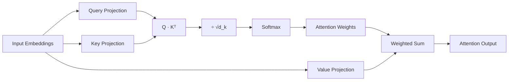

**When to draw this:** Any question about "explain attention," transformer architecture, or why attention scales quadratically with sequence length. The scaling by √d_k is the detail people forget — it prevents large dot products from pushing softmax into near-zero-gradient regions as dimensionality grows.

---

### A2. MHA vs MQA vs GQA (Q291–292)

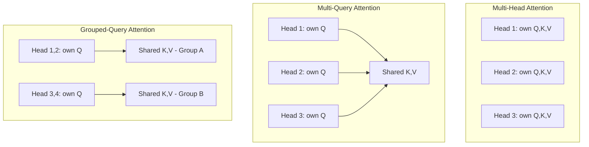

**When to draw this:** Any KV-cache or serving-cost question. The core tradeoff: MHA = best quality, largest KV cache; MQA = smallest KV cache, most quality loss; GQA = the practical middle ground almost every modern production LLM actually uses.

---

### A3. KV Cache & Prefill vs Decode (Q293, Q332)

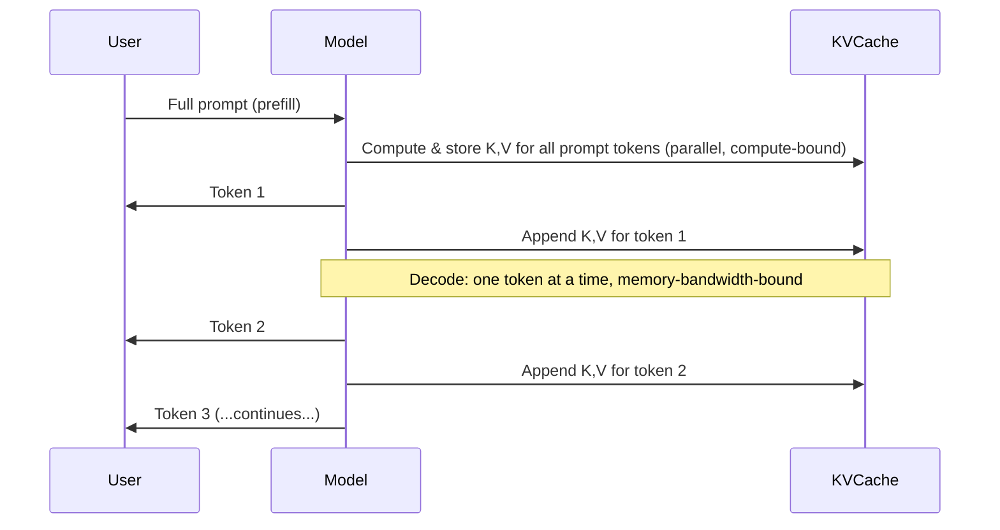

**When to draw this:** Any inference-optimization question. Prefill is parallel and compute-bound (high GPU utilization); decode is sequential and memory-bandwidth-bound (low utilization per step) — this asymmetry is *why* continuous batching and paged attention exist as separate optimizations.

---

### A4. Mixture-of-Experts Routing (Q306–308)

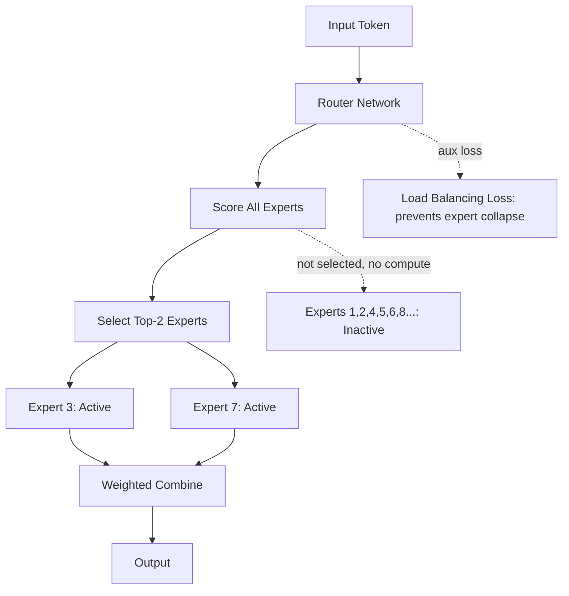

**When to draw this:** Any question about MoE, dense vs sparse serving cost, or why a huge-parameter-count model can be cheap to serve. Key point: total parameters ≠ active parameters per token — that's the entire value proposition of MoE.

---

### A5. Speculative Decoding (Q328)

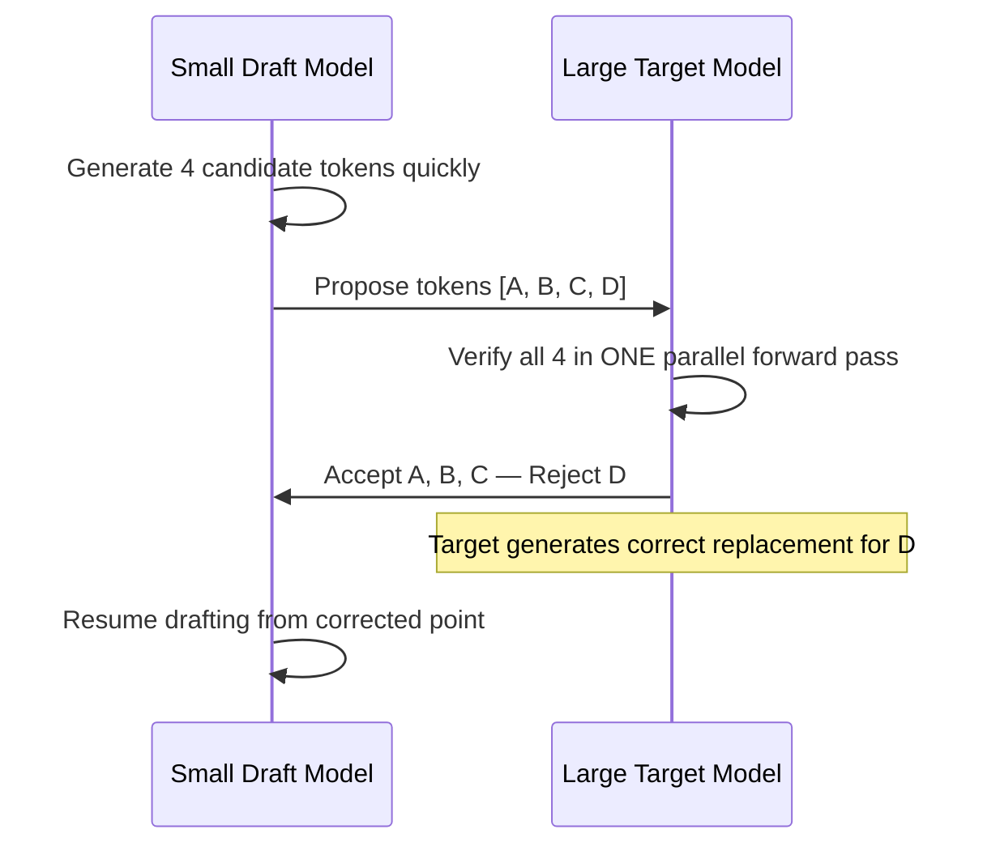

**When to draw this:** Any latency-optimization question. Key insight: the target model's output distribution is unchanged (it's still doing the verification) — this is a pure speedup, not an approximation.

---

### A6. Quantization Precision Pipeline (Q201, Q336–337)

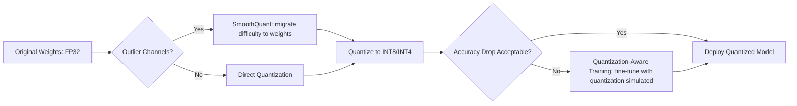

**When to draw this:** Any cost/serving question involving self-hosted models. Post-training quantization is cheap but riskier for accuracy; QAT is expensive but more robust — the outlier problem is the specific technical reason naive quantization fails.

---

## B. Training & Alignment Patterns

### B1. SFT → RLHF/DPO Pipeline (Q309–320)

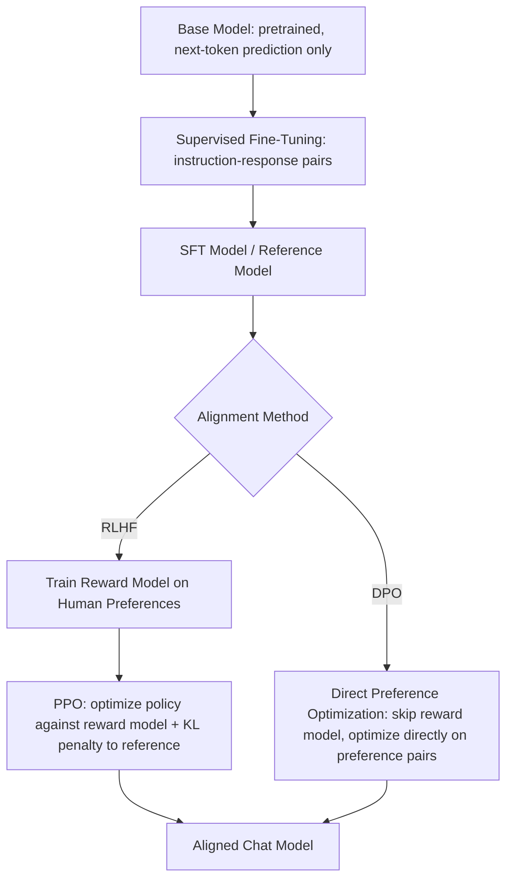

**When to draw this:** Any question about how ChatGPT-style models are built, RLHF vs DPO, or alignment in general. The KL penalty to the reference model is the detail that prevents reward hacking — always mention it.

---

### B2. LoRA / Parameter-Efficient Fine-Tuning (Q318–320)

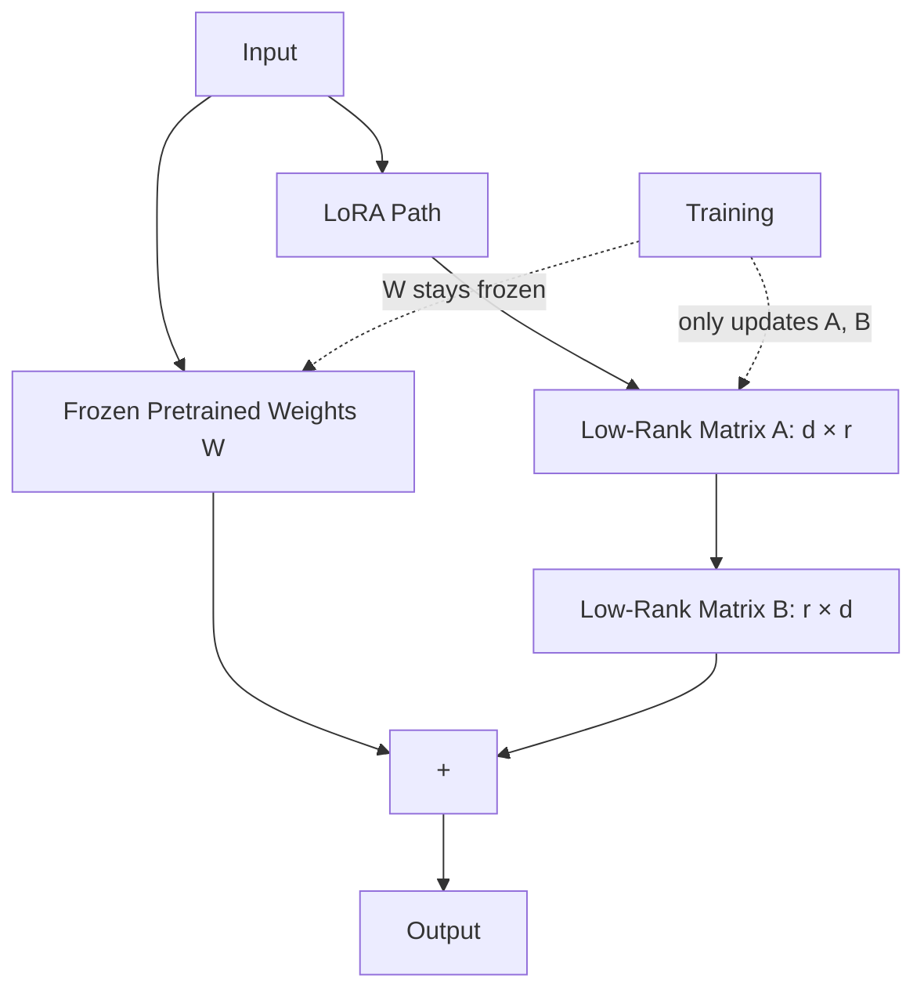

**When to draw this:** Any fine-tuning-cost question. The rank `r` is typically tiny (4-64) compared to `d` (thousands), which is why trainable parameters drop by 100-1000x versus full fine-tuning while retaining most of the quality.

---

### B3. Knowledge Distillation (Q200, Q335)

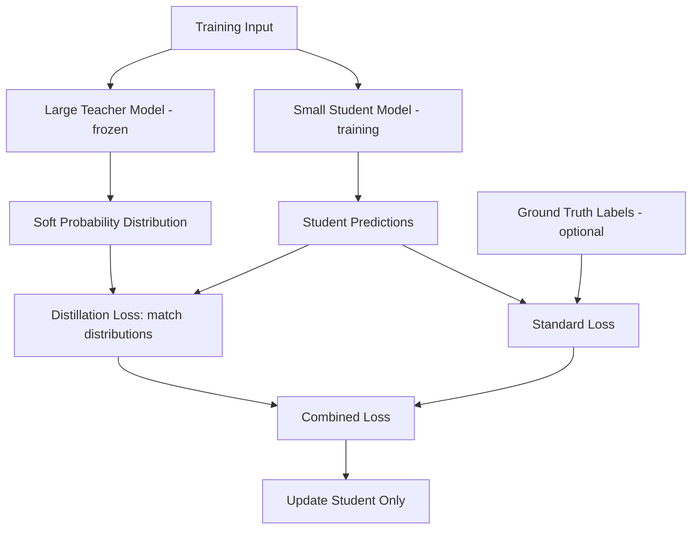

**When to draw this:** Any model-compression or cost-reduction question. Key point: soft labels (full probability distributions) carry more information than hard labels alone — that's why distillation outperforms just training a small model from scratch on the same hard labels.

---

## C. Prompting & Reasoning Patterns

### C1. ReAct Loop (Q348, Q451)

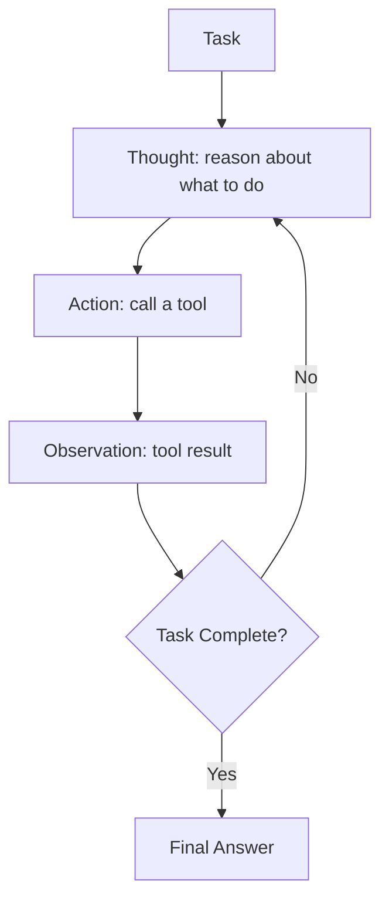

**When to draw this:** Any agent question. This is the single most important loop to be able to draw cold — nearly every agent framework is a variation of Thought → Action → Observation → repeat.

---

### C2. Chain-of-Thought vs Tree-of-Thought vs Self-Consistency (Q324–325, Q349–350)

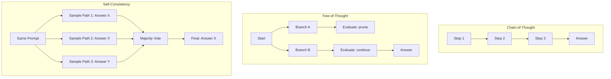

**When to draw this:** Any reasoning-technique comparison question. Cost ordering: CoT is cheapest (1 pass), self-consistency is moderate (N parallel passes + vote), Tree-of-Thought is most expensive (branching search with evaluation) — match the technique to how much the accuracy gain justifies the cost.

---

### C3. Self-RAG / Corrective Retrieval Loop (Q402)

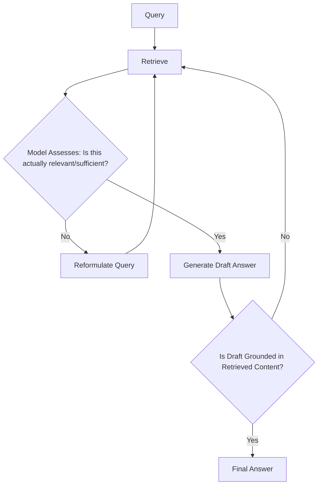

**When to draw this:** Any "how do you reduce RAG hallucination" question. The two self-check gates (retrieval-sufficiency and generation-groundedness) are what distinguish this from naive single-pass RAG.

---

## D. Agent Architecture Patterns

### D1. Plan-and-Execute vs Reactive Single-Loop (Q453–454)

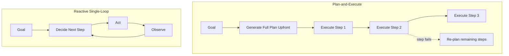

**When to draw this:** Any "how would you architect a complex agent" question. Plan-and-execute is more efficient/predictable for well-understood tasks; reactive is more robust to genuinely novel/surprising situations.

---

### D2. Orchestrator-Worker Multi-Agent Pattern (Q456, Q466)

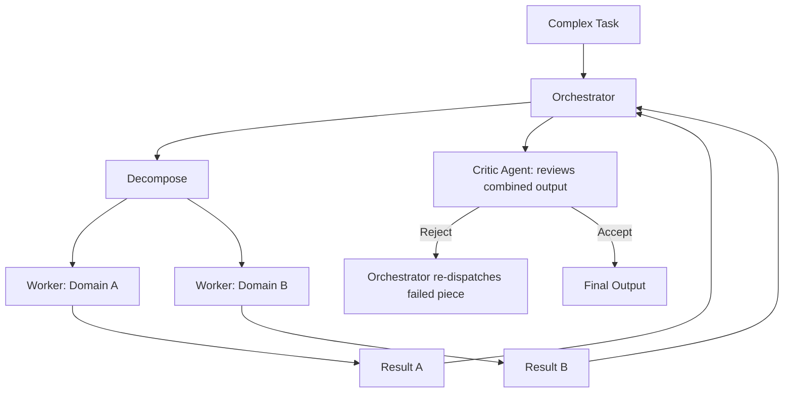

**When to draw this:** Any multi-agent system-design question. The critic-gate-before-finalization detail is what separates a robust design from a naive "agents talking to each other" answer.

---

### D3. Human-in-the-Loop Checkpoint Pattern (Q461, Q477)

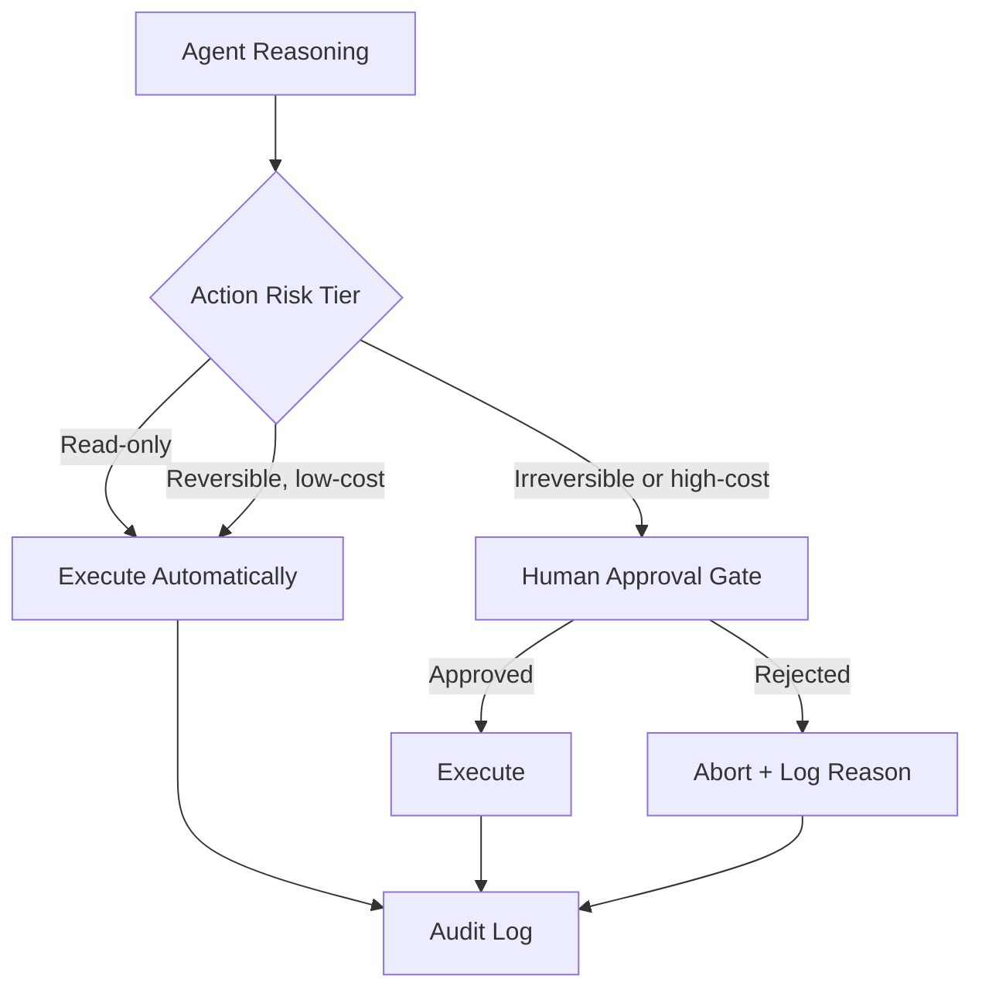

**When to draw this:** Any agent-safety question. The key design decision to always call out explicitly: risk tiering is what makes this scalable — gating *everything* kills usability, gating *nothing* is unsafe.

---

## E. MLOps & Deployment Patterns

### E1. Canary → Shadow → Full Rollout (Q607–609, Q625)

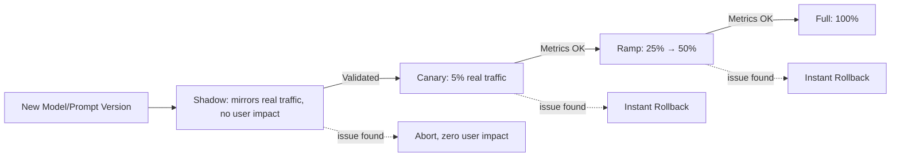

**When to draw this:** Any deployment/rollout question. The progression matters: shadow catches obvious issues with zero risk, canary catches subtler issues with bounded risk, full rollout only happens after both gates clear.

---

### E2. Medallion Data Architecture (Q733)

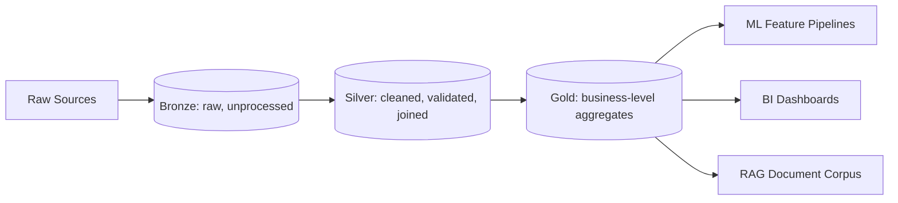

**When to draw this:** Any data-engineering question. Each layer has a distinct purpose: bronze preserves the raw source of truth for reprocessing, silver is where quality/validation happens, gold is what consumers actually query.

---

### E3. Eval-Gated CI/CD (repeated pattern, Q646, Q810, Q831)

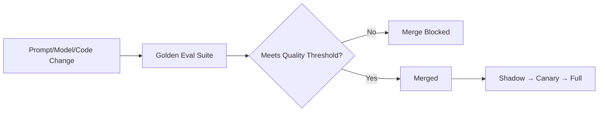

**When to draw this:** Any question about safely shipping AI changes. This is the connective tissue between "how do you eval" questions and "how do you deploy" questions — eval gates *are* the deployment gate, not a separate concern.

---

## F. Safety & Governance Patterns

### F1. Defense-in-Depth Guardrails (Q866–869)

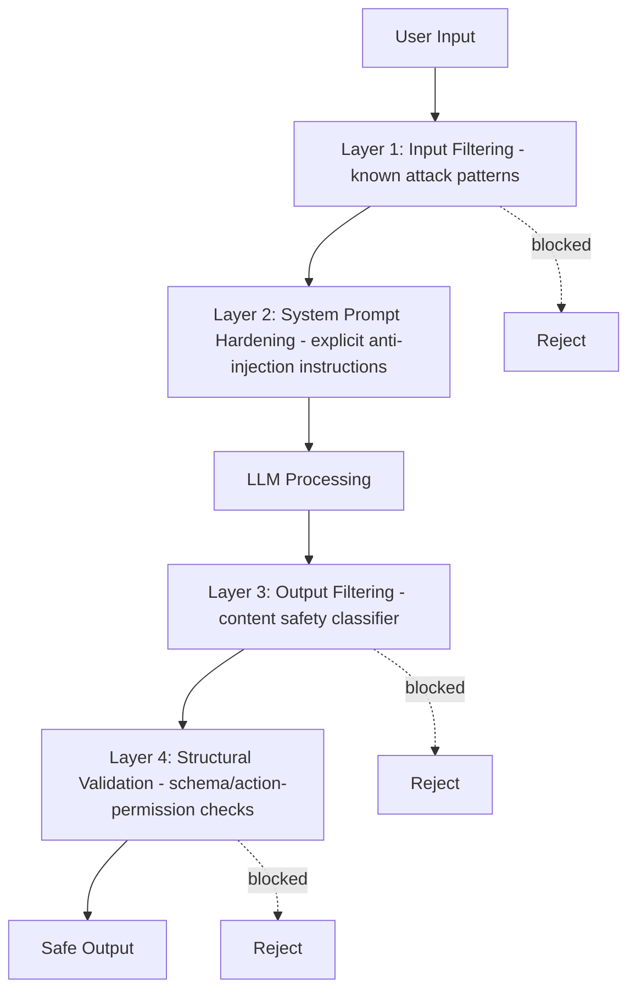

**When to draw this:** Any prompt-injection or safety-architecture question. The point to emphasize: no single layer is sufficient alone — this is why it's called "defense in depth," not "defense in one really good filter."

---

### F2. Red-Team → Eval-Suite Feedback Loop (Q843–844)

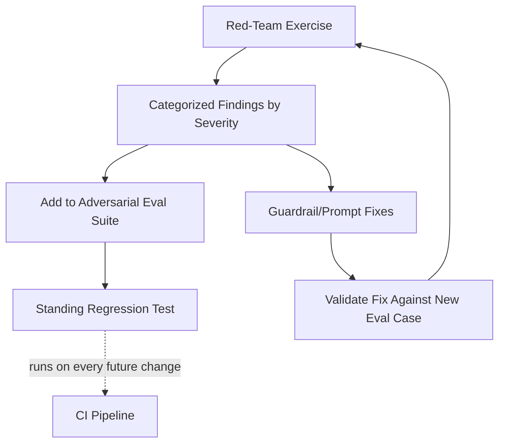

**When to draw this:** Any "how do you handle discovered vulnerabilities" question. The critical detail: every red-team finding becomes a *permanent* regression test, not just a one-time fix — otherwise the same vulnerability can silently reappear after a future change.

---

### F3. Fairness Audit Cycle (Q909, Q932)

```mermaid
flowchart TD
    DEFINE[Define Protected Groups + Fairness Metrics with Legal/Ethics] --> BASELINE[Baseline Audit: pre-launch]
    BASELINE --> LAUNCH{Passes Threshold?}
    LAUNCH -->|No| REMEDIATE[Remediate: reweighting, debiasing]
    REMEDIATE --> BASELINE
    LAUNCH -->|Yes| DEPLOY[Deploy]
    DEPLOY --> ONGOING[Ongoing Production Monitoring]
    ONGOING -.periodic.-> REAUDIT[Scheduled Re-Audit]
    REAUDIT -->|Drift detected| REMEDIATE
```

**When to draw this:** Any governance/bias question. The point that separates a strong answer: fairness auditing is a *cycle*, not a one-time pre-launch checkbox — data and population shift over time, so the audit has to repeat.

---

*This catalog covers the recurring conceptual patterns underlying Sections 1–12 and 15–28. Combined with `ARCHITECTURE_DIAGRAMS.md` (system-design patterns for Sections 13, 14, 27), between the two files nearly every diagrammable concept in the bank now has a visual reference.*

---

## G. Enterprise Governance & Operating-Model Patterns

### G1. AI Maturity Model (Q1093)

```mermaid
flowchart LR
    L1[Level 1: Ad Hoc<br/>scattered experiments] --> L2[Level 2: Repeatable<br/>team-level patterns]
    L2 --> L3[Level 3: Defined<br/>shared platform + governance]
    L3 --> L4[Level 4: Managed<br/>quantitative metrics drive decisions]
    L4 --> L5[Level 5: Optimizing<br/>continuous improvement, proactive risk]
```

**When to draw this:** Any "how do you assess where an org stands" or roadmap-planning question. Most enterprises today sit at Level 2–3; a Principal-level answer should be able to place a hypothetical org on this scale and articulate the specific gap to the next level, not just describe the levels abstractly.

---

### G2. TCO Framework for an Enterprise AI System (Q1094)

```mermaid
flowchart TD
    BUILD[Initial Build Cost] --> TCO[Total Cost of Ownership]
    RUN[Annual Run Cost × Expected Lifespan] --> TCO
    subgraph RunCosts["Commonly Underestimated Run Costs"]
    EVAL[Ongoing Eval Maintenance]
    ONCALL[Incident Response / On-Call]
    DATA[Data Pipeline Upkeep]
    ITER[Prompt/Model Iteration Over Time]
    end
    RunCosts --> RUN
    RISK[Risk-Adjusted Incident Cost] --> TCO
```

**When to draw this:** Any cost-justification or build-vs-buy question. The point that separates a strong answer: most people only budget the "Build" box — the run-cost sub-boxes are where enterprise AI TCO is chronically underestimated.

---

### G3. Build-vs-Buy-vs-Partner Weighted Scorecard (Q1095)

```mermaid
flowchart TD
    OPTION[Candidate Option: Build / Buy / Partner] --> D1[Differentiation Value - weight: high]
    OPTION --> D2[Time to Value - weight: medium]
    OPTION --> D3[TCO - weight: high]
    OPTION --> D4[Data/IP Control - weight: medium]
    OPTION --> D5[Lock-in Risk - weight: medium]
    OPTION --> D6[Internal Maintain Capability - weight: medium]
    D1 --> SCORE[Weighted Composite Score]
    D2 --> SCORE
    D3 --> SCORE
    D4 --> SCORE
    D5 --> SCORE
    D6 --> SCORE
    SCORE --> DECISION[Decision: filled out BEFORE the team has a preference]
```

**When to draw this:** Any build-vs-buy question. The critical caveat to always state out loud: the scorecard only has integrity if it's filled out before the team's emotional preference forms — otherwise it's theater justifying a decision already made.

---

### G4. Enterprise System Integration Pattern (SAP/Salesforce/ServiceNow) (Q1098–1100)

```mermaid
flowchart TD
    AI[AI Feature] --> NATIVE{Integration Approach}
    NATIVE -->|Preferred| EXTENSION[Native Extension Framework: SAP BTP / Salesforce Apex / ServiceNow Virtual Agent]
    NATIVE -->|Avoid| PARALLEL[Parallel External Tool: shadow-IT risk]
    EXTENSION --> INHERIT[Inherits Existing Permission Model + Audit Trail]
    EXTENSION --> READONLY{Write Action?}
    READONLY -->|Yes| APPROVAL[Routes Through Existing Business-Process Approval]
    READONLY -->|No| DIRECT[Direct Read Access]
    PARALLEL -.x.-> RISK[Separate access-control system to maintain, audit gaps]
```

**When to draw this:** Any enterprise-integration question (SAP, Salesforce, ServiceNow, or similar). The core principle generalizes beyond any single vendor: build inside the system of record's native extension framework so permissions/audit are inherited, never build a parallel tool that requires a second access-control system to keep in sync.

---

### G5. AI Center of Excellence RACI (Q1101)

```mermaid
flowchart TD
    subgraph CoE["AI Center of Excellence"]
    PLATFORM[ML Platform Team: Responsible - shared infra, gateway, eval, guardrails]
    end
    subgraph Governance
    LEGAL[Legal/Compliance: Accountable - regulatory interpretation]
    SECURITY[Security: Accountable - data/access controls]
    end
    subgraph Delivery
    PRODUCT[Product Teams: Responsible + Accountable - their own feature outcomes]
    DATAENG[Data Engineering: Responsible - pipeline/data quality]
    end
    EXEC[Executive Sponsor: Accountable - overall strategy, Informed on projects]

    PLATFORM -.provides platform to.-> PRODUCT
    LEGAL -.consulted on.-> PRODUCT
    SECURITY -.consulted on.-> PRODUCT
    EXEC -.sponsors.-> CoE
```

**When to draw this:** Any AI CoE or organizational-design question. The detail that distinguishes a strong answer: Product teams remain accountable for *their own* outcomes — the CoE's job is to provide platform and guardrails, not to own every team's product decisions, which is the most common design mistake in real enterprise AI CoE rollouts.

---

*These five patterns extend the catalog into enterprise governance/operating-model territory, complementing the technical patterns in sections A–F above. Combined with Section 29 in the question bank, this closes the gap between "can build the system" and "can operate AI at true enterprise scale."*

<script>
document.addEventListener("DOMContentLoaded", function () {
  mermaid.initialize({ startOnLoad: false, theme: "default" });
  var blocks = document.querySelectorAll("pre code.language-mermaid, code.language-mermaid");
  blocks.forEach(function (code, i) {
    var text = code.textContent;
    var container = code.closest("div.highlighter-rouge") || code.closest("pre");
    var div = document.createElement("div");
    div.className = "mermaid";
    div.id = "mermaid-" + i;
    div.textContent = text;
    container.parentNode.replaceChild(div, container);
  });
  mermaid.run({ querySelector: ".mermaid" });
});
</script>
